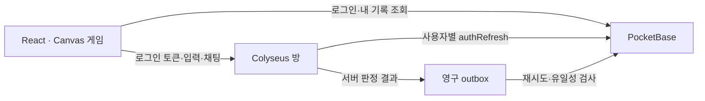

# 픽셀타운 · 미니홈피 도트 마을 (재제작판)

싸이월드 미니홈피 프레임 안의 작은 도트 마을을 걷고, 이웃과 말풍선으로 수다를 떨고, 마을 곳곳의 별을 모아 옷·펫·가구를 사서 꾸미는 로컬 멀티플레이 게임이다. React/Vite, 자체 Canvas 2D 도트 그래픽, PocketBase, Colyseus를 쓴다. 그래픽은 모두 자체 절차 코드로 그렸고 폰트는 OFL Galmuri11을 로컬 번들한다. 외부 이미지·CDN·MQTT 브로커 없이 플레이한다. 원 서비스의 코드·자산은 포함하지 않았다.


## 프로젝트 구조

```text
pixeltown/
├── docs/             # 게임기획 · PRD · 기술 명세 · 검증
├── game/             # React · Canvas 게임
├── pocketbase/       # 인증 · 영구 데이터 · DB 훅
├── colyseus/         # 방 · 이동 · 미니게임 서버
├── shared/           # 게임과 서버가 함께 쓰는 맵 · 충돌 · 경로 정의
├── scripts/          # 두 서버와 게임을 함께 실행
└── tests/            # 실제 서버 통합 검증 · 브라우저 UI 검증
```

각 구성은 같은 부모 폴더의 형제 디렉터리에 있다. 브라우저→PocketBase 로그인, 브라우저→Colyseus 토큰 입장, Colyseus→PocketBase 검증·결과 저장으로 연결된다. 데이터 위치: `pocketbase/.local/pb_data`, `colyseus/.local/outbox`. 관리자 파일: `pocketbase/.env.local`.

## 실행

Node.js 22 이상, macOS 또는 Linux, `curl`과 `unzip`이 필요하다.

```sh
npm install
npm --prefix colyseus install
npm run dev:all
```

http://127.0.0.1:5173 을 연다. macOS에서는 `start.command`를 더블클릭해도 된다. 첫 실행에 공식 PocketBase 0.40.4 바이너리를 다운로드하고 checksum을 검증하며, 개발용 DB와 두 계정을 만든다. 패키지·바이너리를 한 번 설치하면 실행·게임에는 외부 인터넷이 필요 없다.

첫 화면에서 캐릭터를 만들면 게스트 계정이 자동으로 생기고 이 브라우저에 저장된다. 다음에 열면 바로 입장한다. 두 사람을 시험하려면 다른 브라우저나 시크릿 창을 쓴다(같은 브라우저는 같은 캐릭터). 로컬 시드 계정 `demo1/demo2@pixeltown.local`(`PixelTown123!`)은 자동 테스트용이며 화면에 로그인 입력은 없다.

서버는 `127.0.0.1`에만 바인딩한다. 사용할 포트가 이미 사용 중이면 시작을 거부한다. 기존 프로세스를 강제로 종료하거나 기존 PocketBase 데이터에 연결하지 않는다. 다른 체크아웃이 기본 포트를 쓰고 있으면 포트를 바꿔 나란히 실행한다.

```sh
PIXELTOWN_PB_PORT=18190 PIXELTOWN_GAME_PORT=12667 PIXELTOWN_WEB_PORT=5273 npm run dev:all
# → http://127.0.0.1:5273
```

Ctrl+C는 이 실행으로 시작한 서버들을 종료한다.

### Mac mini 서버에 연결 (원격 모드)

배포 주소는 **https://pixeltown.fastmake.net**(Cloudflare Pages, `main` push 시 자동 배포)이다. 게임 서버는 Mac mini의 PocketBase(`https://pixeltown-pb.fastmake.net`)와 Colyseus(`wss://pixeltown-rt.fastmake.net`)다. 이 컴퓨터에서 프런트만 띄워 같은 서버로 플레이할 수도 있다.

```sh
npm run dev:remote   # → http://127.0.0.1:5173 (.env.remote의 공개 주소 사용)
```

원격에도 첫 화면에서 캐릭터를 만들면 게스트 계정이 생긴다. 자동 검증용 Tester 계정 자격증명은 `pocketbase/.local/remote-accounts.json`(git 제외)에만 있다. 서버 배치·백업·운영은 [docs/SERVER_OPERATIONS.md](docs/SERVER_OPERATIONS.md)를 참고한다.

## 확인할 플레이 흐름

1. 첫 화면에서 캐릭터(닉네임·피부·머리 색·머리 모양·옷 색)를 만들고 입장한다. 이미 쓰는 닉네임이면 입력칸 아래에 안내가 뜬다. 게임 안 "🎨 캐릭터 꾸미기"로 언제든 바꾸며 같은 방 사람에게 바로 보인다. 미니홈피 프레임의 TODAY 숫자와 제목줄에 접속 인원이 보인다.
2. WASD/방향키로 걷거나 미니룸을 클릭(모바일은 탭)해 그 지점까지 최단 경로로 걸어간다. 목적지는 바닥에 분홍 표시가 뜨고, 채팅 로그 위를 눌러도 이동한다. 건물을 누르면 가장 가까운 곳까지 가고, 방향키를 누르면 경로가 취소된다. 모바일은 방향 패드도 있다. 다른 창에도 이동이 보인다.
3. 광장 나무 북쪽으로 가면 수관에 가려지고 남쪽으로 오면 앞에 나온다. 건물 뒤 잔디로 돌아가면 지붕에 가려진다. 벽·물·생울타리는 통과하지 못한다.
4. Enter로 채팅을 열어 보낸다. 상대 머리 위에 말풍선이 뜬다. 채팅 배경은 20–95%로 조절되고 접힘 상태와 함께 기억된다. 접힌 동안 받은 메시지는 배지에 쌓인다. Space 또는 인사 버튼으로 하트를 보낸다.
5. 광장 동쪽 끝 분홍 매트를 밟으면 정원, 서쪽 매트는 오락실로 간다. 오른쪽 폴더 탭으로도 이동한다. 다른 방의 사용자는 보이지 않는다.
6. 별 모으기는 시작 버튼 없는 상시 이벤트다. 별 가까이 가면 서버가 수집을 판정한다. 별은 최소 5개, 6초마다 1개씩 맵 전체에 흩어져 생기고 방별 미회수 12개에서 멈춘다. 3분마다 점수가 정산되어 별 보상으로 저장되고 이벤트는 계속된다.
7. 🛍 별 상점에서 모자·옷·펫·가구를 산다(지갑 = 받은 별 − 쓴 별). 옷장에서 입히면 같은 방 사람에게도 보이고 펫이 뒤(정면을 볼 때는 옆)를 따라온다.
8. 오른쪽 🏠 미니룸 탭에서 "가구 배치"를 눌러 산 가구를 바닥에 놓고 저장한다. 문 앞·겹침·바닥 밖은 거절된다.
9. 내 수첩에서 결과·별 보상·산 물건을 재조회한다. 새로고침하거나 다시 방문해도 같은 캐릭터로 남는다.
10. 연결이 끊기면 안내와 다시 연결 버튼이 나온다. 채팅은 메모리 상태이며 재조회하지 않는다.

## 책임과 저장



PocketBase는 사용자·프로필·방 메타데이터·결과·보상 원장을 보관한다. Colyseus는 방 접속·이동·별 수집 거리·경기 시간·점수를 판정한다. 위치를 매 프레임 DB에 쓰지 않는다. 브라우저의 사용자 ID·좌표·점수 주장은 권한의 근거가 되지 않는다.

각 사용자 토큰 검증마다 별도 SDK 인스턴스로 `authRefresh()`를 호출한다. Colyseus 기본 JWT 인증에 PocketBase 토큰을 맡기지 않는다. 서버용 관리자 자격증명은 `pocketbase/.env.local`에 무작위로 생성되며 브라우저 bundle에 포함되지 않는다.

경기 완료 전에 outbox 파일을 디스크에 기록한다. PocketBase 저장에 실패하면 재시도하고, 서버 재시작 후에도 미처리 파일을 다시 읽는다. 결과·보상은 각각 `(match_id,user)` unique 원장으로 중복을 차단하며, PocketBase 트랜잭션에서 함께 저장한다. 같은 결과 재전송은 무해하게 처리하고 다른 점수로 재전송하면 거부한다. 디스크 자체 손실이나 프로세스가 경기 완료 전에 강제 종료된 경우까지 경기 복원을 보장하지 않는다.

## 검증

개발 서버를 종료한 상태에서 실행한다. 테스트는 자신이 시작한 프로세스와 별도 테스트 DB만 사용하며 기존 DB를 수정하지 않는다.

```sh
npm --prefix colyseus run init  # 아직 한 번도 실행하지 않았다면 바이너리와 시드 준비
npm run test:integration   # 기본 포트가 사용 중이면 PIXELTOWN_TEST_PB_PORT / PIXELTOWN_TEST_GAME_PORT 지정
PIXELTOWN_LOAD_100=1 npm run test:integration   # 선택: 100명 채널 방 분할 측정 추가
node tests/remote-check.mjs  # 선택: Mac mini 원격 2유저 기능 검증(약 4분)
npm --prefix colyseus test # 맵 연결성·깊이·충돌·별 상한 단위 테스트
npm run build
# 브라우저 검증: dev 서버 실행 중에 (Chromium 경로 지정)
CHROME_PATH=/path/to/chromium PIXELTOWN_WEB_PORT=5273 PIXELTOWN_PB_PORT=18190 node tests/ui-check.mjs
```

자동 테스트 결과는 `tests/report.json`, 브라우저 결과는 `tests/ui-report.json`과 `docs/assets/`에 기록한다. 두 사용자 로그인·이동·채팅·방 분리·미니게임·결과 조회, 잘못된 토큰·ID 위조·결과 조작·중복 저장, 저장 장애와 복구를 검증한다. 20개 클라이언트의 짧은 localhost 부하 검증은 실제 인터넷 성능이나 최대 수용량을 뜻하지 않는다. 상세 측정과 화면 확인 결과는 `docs/verification.md`를 참고한다.

공개 저장소: [cheng80/pixeltown-demo](https://github.com/cheng80/pixeltown-demo). 게임기획·PRD는 [docs 안내](docs/README.md), 최신 검증과 인수인계는 [프로젝트 현황](docs/03_PROJECT_STATUS.md)을 참고한다.

## 파일과 확장

- `game/src/`: `main.jsx`(미니홈피 UI·입력·채팅), `render.js`(3계층 깊이 렌더러), `sprites.js`(도트 스프라이트·아바타·지형)
- `shared/world.js`: 세 장소 타일맵·소품 그림/바닥 충돌·이동·경로 — 게임과 서버 공용
- `colyseus/`: 실시간 서버, 인증, 서버 판정, 저장 outbox
- `pocketbase/`: DB·인증 서버 바이너리·개발 데이터·관리자 설정·트랜잭션 훅
- `scripts/`: 개발 인스턴스 초기화·실행
- `tests/`: 실제 서버 통합 검증(`integration.mjs`), 브라우저 UI 검증(`ui-check.mjs`)
- `docs/analysis.md`: 원본 조사와 근거·한계

100명·PWA·앱 포장은 이후 검토 대상이다. 현재 데모는 단일 개발 머신용이며 외부 배포·TLS·지속 운영은 검증하지 않았다. 호스팅할 때는 방별 delta 전송·관심 영역·DB 백업·로그·배포 환경변수를 먼저 검토한다. 기존 Oracle 작업과 운영 서버를 수정하지 않는다.
