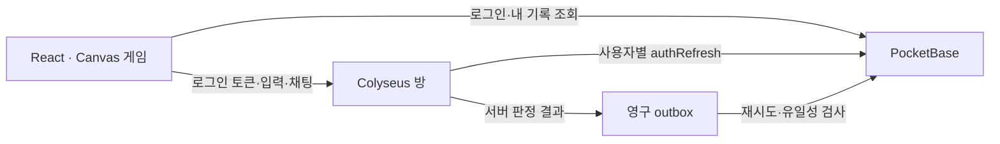

# 픽셀타운 · 플레이 가능한 로컬 데모

React/Vite, 자체 Canvas 2D 도트 그래픽, PocketBase, Colyseus를 사용하는 게임이다. 외부 이미지·폰트·MQTT 브로커 없이 로컬 서버 두 개로 플레이한다. 원 서비스의 코드·자산은 이 데모에 포함하지 않았다.

## 프로젝트 구조

```text
pixeltown/
├── docs/             # 게임기획 · PRD · 기술 명세 · 검증
├── game/             # React · Canvas 게임
├── pocketbase/       # 인증 · 영구 데이터 · DB 훅
├── colyseus/         # 방 · 이동 · 미니게임 서버
├── scripts/          # 두 서버와 게임을 함께 실행
└── tests/            # 실제 서버 통합 검증
```

각 구성은 같은 부모 폴더의 형제 디렉터리에 있다. 브라우저→PocketBase 로그인, 브라우저→Colyseus 토큰 입장, Colyseus→PocketBase 검증·결과 저장으로 연결된다. 데이터 위치: `pocketbase/.local/pb_data`, `colyseus/.local/outbox`. 관리자 파일: `pocketbase/.env.local`.

## 실행

Node.js 22 이상, macOS 또는 Linux, `curl`과 `unzip`이 필요하다.

```sh
npm install
npm --prefix colyseus install
npm run dev:all
```

http://127.0.0.1:5173 을 연다. macOS에서는 `start.command`를 더블클릭해도 된다. 첫 실행에 공식 PocketBase 0.40.4 바이너리를 다운로드하고 checksum을 검증하며, 개발용 DB와 두 계정을 만든다. 패키지·바이너리를 한 번 설치하면 실행·게임에는 외부 인터넷이 필요 없다.

계정: `demo1@pixeltown.local`, `demo2@pixeltown.local` / 공통 비밀번호: `PixelTown123!`. 화면의 데모 계정 버튼으로 입력할 수 있다. 두 브라우저 또는 시크릿 창을 사용해 서로 다른 계정으로 로그인한다. 같은 브라우저 탭만 복제하면 로그인 저장소가 공유될 수 있다.

서버는 `127.0.0.1`에만 바인딩한다. PocketBase `18090`, Colyseus `12567`, Vite `5173`이 이미 사용 중이면 시작을 거부한다. 기존 프로세스를 강제로 종료하거나 기존 PocketBase 운영 데이터에 연결하지 않는다. Ctrl+C는 이 실행으로 시작한 서버들을 종료한다.

## 확인할 플레이 흐름

1. 서로 다른 계정으로 입장하고 접속 인원·이름을 확인한다.
2. WASD 또는 방향키로 걷는다. 모바일에서는 방향 패드를 사용한다. 다른 창에도 이동이 보이는지 확인한다.
3. 채팅을 보내고 다른 창에서 수신한다. 게임 위의 반투명 채팅 배경은 20–95%로 조절할 수 있다. 설정은 브라우저에 유지되며 접기·펼치기와 미확인 메시지 표시를 지원한다. 인사 버튼으로 이모트를 보낸다.
4. 로비·가든·아케이드로 이동한다. 다른 방의 사용자는 보이지 않아야 한다.
5. 같은 방에서 별 모으기를 시작하고 별 가까이 이동해 수집한다. 제한 시간이 끝나면 서버 점수·보상이 저장된다. 별은 초기 5개, 1.5초마다 1개 생성하며 방별 미회수 12개에 도달하면 생성을 멈춘다. 회수 후 다음 주기에 빈자리만 채운다.
6. 기록 화면에서 결과와 보상을 재조회한다. 새로고침·다시 로그인 후에도 남아 있어야 한다.
7. 서버 연결이 끊기면 상태 안내를 확인하고 재접속한다. 재입장 위치는 시작점으로 초기화되며, 진행 중 경기의 점수는 방이 살아 있는 동안 사용자 ID별로 유지된다. 채팅은 메모리 상태이며 재조회하지 않는다.

## 책임과 저장



PocketBase는 사용자·프로필·방 메타데이터·결과·보상 원장을 보관한다. Colyseus는 방 접속·이동·별 수집 거리·경기 시간·점수를 판정한다. 위치를 매 프레임 DB에 쓰지 않는다. 브라우저의 사용자 ID·좌표·점수 주장은 권한의 근거가 되지 않는다.

각 사용자 토큰 검증마다 별도 SDK 인스턴스로 `authRefresh()`를 호출한다. Colyseus 기본 JWT 인증에 PocketBase 토큰을 맡기지 않는다. 서버용 관리자 자격증명은 `pocketbase/.env.local`에 무작위로 생성되며 브라우저 bundle에 포함되지 않는다.

경기 완료 전에 outbox 파일을 디스크에 기록한다. PocketBase 저장에 실패하면 재시도하고, 서버 재시작 후에도 미처리 파일을 다시 읽는다. 결과·보상은 각각 `(match_id,user)` unique 원장으로 중복을 차단하며, PocketBase 트랜잭션에서 함께 저장한다. 같은 결과 재전송은 무해하게 처리하고 다른 점수로 재전송하면 거부한다. 디스크 자체 손실이나 프로세스가 경기 완료 전에 강제 종료된 경우까지 경기 복원을 보장하지 않는다.

## 검증

개발 서버를 종료한 상태에서 실행한다. 테스트는 자신이 시작한 프로세스와 별도 테스트 DB만 사용하며 기존 DB를 수정하지 않는다.

```sh
npm --prefix colyseus run init  # 아직 한 번도 실행하지 않았다면 바이너리와 시드 준비
npm run test:integration
npm --prefix colyseus test
npm run build
```

자동 테스트 결과는 `tests/report.json`에 기록한다. 두 사용자 로그인·이동·채팅·방 분리·미니게임·결과 조회, 잘못된 토큰·ID 위조·결과 조작·중복 저장, 저장 장애와 복구를 검증한다. 20개 클라이언트의 짧은 localhost 부하 검증은 실제 인터넷 성능이나 최대 수용량을 뜻하지 않는다. 상세 측정과 화면 확인 결과는 `docs/verification.md`를 참고한다.

공개 저장소: [cheng80/pixeltown-demo](https://github.com/cheng80/pixeltown-demo). 게임기획·PRD는 [docs 안내](docs/README.md), 최신 검증과 인수인계는 [프로젝트 현황](docs/03_PROJECT_STATUS.md)을 참고한다.

## 파일과 확장

- `game/src/`: 게임 화면·도트 렌더링·입력
- `colyseus/`: 실시간 서버, 인증, 서버 판정, 저장 outbox
- `pocketbase/`: DB·인증 서버 바이너리·개발 데이터·관리자 설정·트랜잭션 훅
- `scripts/`: 개발 인스턴스 초기화·실행
- `tests/`: 실제 서버 통합 검증
- `docs/analysis.md`: 원본 조사와 근거·한계

100명·PWA·앱 포장은 이후 검토 대상이다. 현재 데모는 단일 개발 머신용이며 외부 배포·TLS·지속 운영은 검증하지 않았다. 호스팅할 때는 방별 delta 전송·관심 영역·DB 백업·로그·배포 환경변수를 먼저 검토한다. 기존 Oracle 작업과 운영 서버를 수정하지 않는다.
