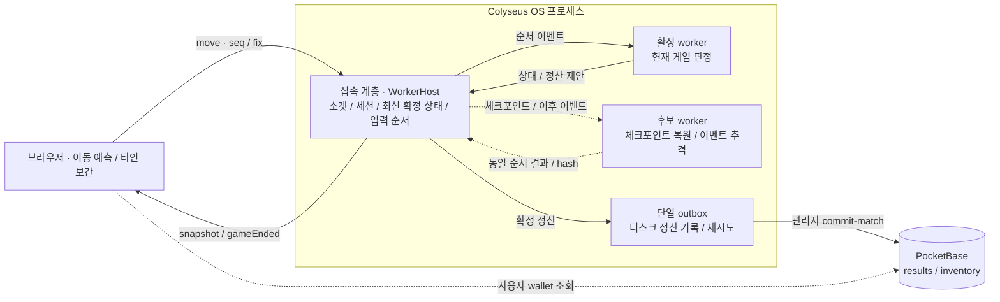
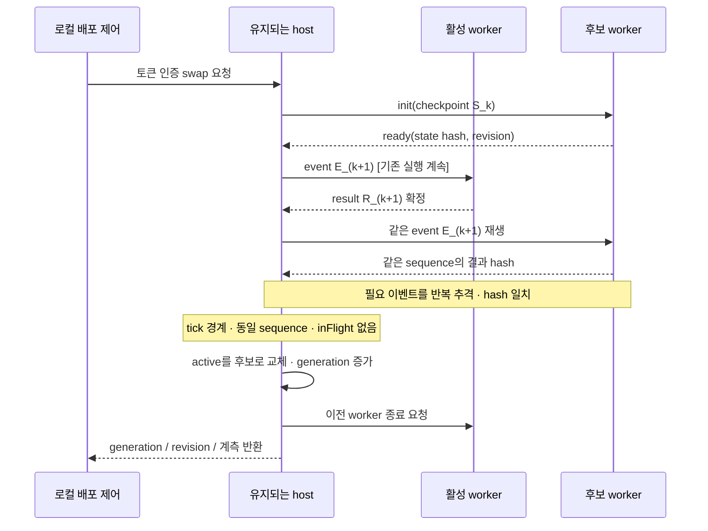

# 게임 로직 무중단 배포 인계

작성일: 2026-10-08 · 대상: PixelTown 최소 게임 `minimal/` · 구현 기준: main 체크아웃의 미커밋 소스.

플레이 중에 게임 코드를 교체해도 연결과 위치·모은 별을 유지하는 구조다.

접속 담당은 두고 게임 담당만 바꾼다. 게임 담당은 서버 안의 별도 스레드인 worker다. 새 worker가 현재 상태와 이후 입력을 이어받아 같은 결과를 내는지 확인한 뒤 교체한다.

[전체 구조와 교체 순서](../diagrams/worker-hot-swap.html)는 그림으로도 볼 수 있다. 아래는 동작 설명이고 1절부터는 구현 세부 사항이다. 계약은 [TECH_SPEC](../02_TECH_SPEC.md#최소-게임-계약-2026-10-08), 진행 상황과 검증 기록은 [PROJECT_STATUS](../03_PROJECT_STATUS.md)를 기준으로 삼는다.

## 동작 설명

### 서버를 재시작하지 않는 이유

서버를 재시작하면 접속도 끊긴다. 플레이어는 다시 접속해야 하고 저장 전의 위치나 점수가 사라질 수 있다. 이 문제를 피하려고 접속 관리와 게임 처리를 나눴다.

| 구성 요소 | 하는 일 | 구현 |
|---|---|---|
| 접속·상태 관리 | 연결, 현재 위치·점수·입력, 마지막 확정 결과를 보관한다. 교체 중에도 계속 실행한다. | Colyseus room + `WorkerHost` |
| 실행 중인 worker | 이동 가능 여부, 별 획득, 점수를 판정한다. | 활성 worker + `Simulation` |
| 새 worker | 새 코드로 시작해 현재 상태를 복사하고 이후 입력을 같은 순서로 처리한다. | 후보 worker |
| 저장 대기함 | 정산할 별을 먼저 파일에 적는다. DB 전송에 실패하면 파일을 남겨 다시 보낸다. | `MinimalOutbox` |
| 별 기록 DB | 정산된 별과 결과를 보관한다. 같은 정산을 다시 받아도 중복 지급하지 않는다. | PocketBase |

두 worker는 같은 서버 프로세스 안에서 실행된다.

### 교체 순서

1. 실행 중인 worker가 계속 게임을 처리한다. 플레이어는 걷고 별을 모을 수 있다.
2. 새 worker가 현재 상태를 복사한다. 위치·점수, 진행 중인 판, 별 목록, 이동 제한, 저장 대기 상태를 가져간다.
3. 복사 중에 들어온 입력도 순서대로 처리한다. 상태 복사만으로는 교체하지 않는다.
4. 두 worker의 결과를 비교한다. 같은 입력에서 위치나 점수가 다르게 나오면 교체를 취소한다.
5. 짧은 처리 구간이 끝나면 새 worker로 바꾼다. 다음 입력부터 새 worker가 처리하고 이전 worker는 종료한다. 접속은 그대로 유지한다.

정상 교체 때는 교체 버튼이나 재접속 안내를 띄우지 않는다. 플레이어는 같은 방에서 위치·점수를 유지한 채 계속 움직인다.

### 교체 중 별을 하나 더 모은 경우

아래는 설명용 예시다. 실제 측정 기록은 아니다.

- 새 worker는 처음에 “별 3개” 상태를 복사한다.
- 그동안 실행 중인 worker가 새 별 획득을 처리해 “별 4개”로 바뀐다.
- 새 worker도 그 획득 기록을 따라 처리한다.
- 두 worker 모두 “별 4개”인 것을 확인한 뒤 교체한다.

새 worker가 아직 “별 3개”라면 교체하지 않는다. 이렇게 최신 상태를 확인해 위치나 점수가 되돌아가는 일을 막는다.

### 교체 실패와 실행 장애

새 코드가 시작되지 않거나 결과가 다르거나 준비가 너무 늦으면 새 worker를 취소한다. 실행 중인 worker는 계속 처리한다.

실행 중인 worker가 멈추면 마지막 확정 상태와 처리하지 못한 입력으로 복구를 시도한다. 이때 처리가 잠시 늦어질 수 있다. 복구에도 실패하면 기존 장애 안내가 표시될 수 있다. 정상 교체와 달리 장애 복구에서는 이런 지연을 예상해야 한다.

### 정산 파일 기록과 DB 저장

정산 내용을 저장 대기함에 파일로 남긴 뒤 화면에 알리고 DB로 보낸다. 파일 기록을 마쳤어도 DB 저장은 아직 끝나지 않았을 수 있다. 전송이 늦거나 실패하면 파일을 남겨 다시 보낸다. 화면의 “저장된 별”은 DB에서 확인한 값이다. 미확인 금액은 “정산 대기”로 남고 재전송해도 같은 정산을 중복 지급하지 않는다.

### 인계 시점의 상태

- 별도 로컬 검사 서버에서 구현·검증을 마쳤다. 실제 100명 활동과 두 브라우저에서 교체를 시험했다.
- 검증 당시 5270/18120/12620은 이전 코드로 실행 중이었다. 보존 요청에 따라 재시작하지 않았다. 당시 `hotSwap:false`였던 이유는 새 구조를 아직 로드하지 않았기 때문이다.
- 초기 로컬 검증 뒤 사용자가 도입·검증 진행을 승인했다. 기존 운영 서버는 유지하고 최소 서버를 별도 포트·DB·주소에 도입했다. 접속 계층을 처음 도입하는 작업은 이미 실행 중인 새 구조에서 worker를 바꾸는 작업과 별개다.
- 서버 전체를 껐다 켜거나 컴퓨터를 재부팅하는 것까지 무중단으로 만든 것은 아니다.
- 토큰·DB·outbox·기존 사용자 작업을 보존한다. 최신 게시·검증 결과는 PROJECT_STATUS를 따른다.

### 용어

| 용어 | 쉬운 뜻 |
|---|---|
| worker | 게임 규칙을 처리하는 별도 스레드. 서버 프로세스 안에서 실행 |
| 체크포인트 | 다시 이어서 처리할 수 있도록 모아 둔 현재 게임 상태 |
| 추격 / replay | 상태를 복사한 뒤 새로 생긴 입력도 같은 순서로 따라 처리하는 것 |
| tick / 틱 | 게임을 주기적으로 처리하는 짧은 한 구간. 기본 50ms, 즉 1초에 약 20번 |
| snapshot | 서버가 알려 주는 현재 게임 현황. 모든 과거 움직임 기록이라는 뜻은 아님 |
| hash | 두 결과를 비교하려고 상태를 짧은 문자열로 만든 값 |
| 승격 / 권한 전환 | 새 worker의 결과를 실제 게임에 반영하기 시작하는 전환 |
| seq / ack | 플레이어가 보낸 이동 번호 / 서버가 받아들였다고 확인한 이동 번호 |
| fix | 서버가 잘못된 이동을 보정할 때 올리는 번호. 오래된 보정 상태의 입력을 구분 |
| outbox | DB에 보낼 정산 파일을 남겨 두는 저장 대기함 |
| 멱등성 | 같은 정산을 다시 받아도 별을 한 번만 지급하는 성질 |
| generation / revision | worker가 교체된 세대 번호 / 실제 읽어 실행한 소스의 식별값 |

구현 세부 사항은 다음 절부터 설명한다. Mermaid 원본은 이 Markdown에 있고 [HTML 다이어그램](../diagrams/worker-hot-swap.html)은 브라우저에서 열면 된다.

## 1. 적용 범위

| 대상 | 현재 범위 |
|---|---|
| 교체 단위 | `simulation-worker.js`에서 실행하는 호환 게임 로직 |
| 유지 대상 | WebSocket, room/session, 입퇴장 처리, 입력 순서, 위치/점수, 이동 예산, seq/ack/fix, 별과 판, 정산 대기 |
| 실행 구조 | 하나의 Colyseus OS 프로세스 안에 유지되는 메인 스레드와 교체 가능한 worker threads |
| 외부 저장 | 별도 PocketBase 프로세스와 접속 계층 소유 디스크 outbox |
| 검증 상태 | 별도 로컬 환경에서 100명 활동 중 반복 교체 및 두 실제 브라우저 검증 완료 |
| 기존 로컬 서버 | 검증 당시 5270/18120/12620은 이전 코드로 실행. 보존 요청에 따라 재시작하지 않음 |
| 운영 | 최소 서버는 별도 도입했다. 공개 100명/30분 검사·화면 게시 결과는 PROJECT_STATUS를 따른다 |
| 범위 밖 | 접속 프로세스 자체 교체/강제 종료, PB 업데이트, 호스트 재부팅, 디스크 손실, 다른 이동 규칙·맵으로의 이행 |

worker는 별도 OS 프로세스가 아니다. 정상 worker 교체에서 연결을 유지하는 구조이며, Colyseus OS 프로세스나 호스트를 재시작하면 기존 TCP/WebSocket과 메모리 체크포인트는 소실될 수 있다.

## 2. 전체 구조



브라우저는 PB 게스트 인증과 지갑 조회를 HTTP로 처리하고 게임 입장과 이동은 Colyseus에 보낸다. room/session/WebSocket은 메인 스레드에 유지된다. `WorkerHost`의 내부 큐·체크포인트·후보 추격 journal과 정산 처리도 이 메인 스레드가 소유한다. 그림의 “접속 계층”은 별도 네트워크 프록시나 추가 서버가 아니다.

| 구성 요소 | 책임 | 구현 |
|---|---|---|
| 브라우저 | 즉시 이동 예측, seq/fix 전송, 100ms 타인 보간, 장애 안내 | `minimal/game/src/main.jsx`, `WorldCanvas.jsx`, `api.js`, `state.js` |
| Colyseus room | 인증, 정원 100명, 연결·입퇴장, 50ms 입력 배치와 snapshot 전송 | `colyseus/minimal/server.js` |
| WorkerHost | 이벤트 순서/난수 입력, 최신 확정 상태, 후보 검증·승격, 결과 권한 검사·복구 | `colyseus/minimal/worker-host.js` |
| WorkerRuntime | 체크포인트 복원, 결정적 이벤트 적용, 상태/효과 hash 생성 | `colyseus/minimal/worker-runtime.js` |
| Simulation | 이동 거리·충돌, 별 생성·획득, 점수·판 종료, 정산 제안 | `colyseus/minimal/simulation.js` |
| worker 진입점 | 메인 스레드와 메시지 교환, 실행 소스 revision | `colyseus/minimal/simulation-worker.js` |
| MinimalOutbox | 단일 디스크 기록자·PB 전송자, 파일별 실패 격리와 재시도 | `colyseus/minimal/outbox.js` |
| PocketBase | 인증·프로필·지갑, 전체 매치 멱등 검증, results/inventory 트랜잭션 | `pocketbase/minimal/pb_hooks/` |

후보 worker는 외부 저장이나 브라우저 통지를 하지 않는다. host도 후보의 정산 결과를 확정하지 않는다. 이 제한은 실행 계약이며 Node worker thread가 신뢰하지 않는 코드를 OS 수준에서 격리해 주는 것은 아니다.

## 3. 입력과 결정적 실행

브라우저 이동 메시지는 기존 계약을 유지한다.

```text
move { x, y, seq, fix }
```

`seq`는 브라우저의 이동 순서다. 서버 내부 `sequence`는 명령 배치의 순서이며 입장·교체 입장·퇴장·이동·틱·종료를 모두 포함한다. 두 번호를 같은 의미로 사용하지 않는다.

```text
Event {
  sequence: 이전 확정 sequence + 1,
  entropy: host가 생성한 16바이트 난수의 hex 문자열,
  commands: [{ type, session?, data?, now } ...],
  confirmed: 디스크 기록 완료를 host가 확인한 pendingMatch ID 또는 null
}
```

- 활성 worker에는 한 번에 한 이벤트만 처리시킨다(`inFlight`). 뒤의 이벤트는 host 큐에 대기한다.
- 이동 명령은 수신 시의 `Date.now()`를 보관한다. 50ms 주기에 모아 `tick` 명령과 함께 전달하며 입퇴장 때도 앞서 받은 이동을 먼저 배치에 넣는다.
- worker는 이벤트 `now`를 사용하며 자기 시계로 게임 판정을 바꾸지 않는다.
- 이벤트의 entropy로 해당 이벤트 안의 난수 생성과 UUID 생성을 결정한다. 후보와 활성 worker가 같은 이벤트를 받으면 같은 별·매치 ID를 만든다.
- runtime은 `sequence`가 정확히 다음 번호인지 검사한다. 이동의 중복 seq, fix 세대 불일치, 속도/충돌 검사는 기존 Simulation이 처리한다.

이벤트를 적용하면 다음 결과를 반환한다.

```text
Result { state, effects, outcomes, hash }
hash = SHA-256(JSON.stringify({ state, effects, outcomes }))
```

`effects`는 정산 제안이며 `outcomes`는 입장 성공/거절 결과다. 후보 검증에서는 위치뿐 아니라 결과 전체를 비교한다. hash가 같으면 재생한 이벤트의 결과가 일치한 것이다. 아직 실행하지 않은 입력에서도 같은 결과가 나온다고 보장하지는 않는다.

## 4. 체크포인트와 호환성

| 상태 필드 | 인계 이유 |
|---|---|
| `schema=1`, `rules='minimal-move-v1'`, `sequence` | 계약 버전과 재생 시작 순서 확인 |
| `timing.durationMs/spawnMs` | 판 종료·별 생성 주기 유지 |
| `players` | session → id/name/x/y/ack/fix 유지 |
| `moves` | session별 이동 허용 예산·마지막 처리 시각 유지 |
| `game.id/active/stars/scores/endsAt` | 진행 판·별·점수·남은 시간 유지. 퇴장한 득점자 점수 포함 |
| `starCounter`, `nextStarAt` | 별 ID와 생성 순서·다음 생성 시각 유지 |
| `pendingMatch` | 아직 디스크 기록이 끝나지 않은 동일 정산 재시도 |

room의 소켓·`held` 재접속 대기, 입력 큐, `inFlight`, `completed`, 후보 journal은 host 쪽에 남으므로 worker 체크포인트로 이동하지 않는다. 체크포인트와 journal은 메모리에만 있으며 디스크 복구 로그가 아니다.

runtime은 복원할 때 schema와 rules가 같은지 검사하고 ready 응답에서 체크포인트의 hash를 다시 확인한다. 릴리스가 맵·속도·seq/fix 의미·상태 스키마를 바꾸면 일반 교체 대상에서 제외하고 버전·브라우저 이행 계약을 별도로 정해야 한다. 버전 문자열을 유지한 채 비호환 변경을 넣어도 자동으로 모두 탐지된다고 가정하지 않는다.

`revision`은 worker 진입점, runtime, Simulation, 공용 world의 네 소스 내용을 배열로 만들어 SHA-256 digest한 값이다. 로드한 소스를 식별하는 값이며 전체 빌드 서명이나 의존성 잠금 검증을 대신하지 않는다.

## 5. 후보 준비·추격·틱 경계 승격



정확한 전환 조건은 `WorkerHost.catchUp()`에 있다.

```text
candidate.initialized
AND candidate.pending가 없음
AND candidate.replayed >= 1
AND candidate.sequence == host.state.sequence
AND host.inFlight가 없음
AND host.lastWasTick == true
```

후보를 준비하는 동안에도 활성 worker는 입력·틱·snapshot을 계속 처리한다. host는 후보 생성 이후 확정된 이벤트와 그 결과 hash를 메모리 journal에 추가한다. 후보가 순서대로 재생하고 결과가 일치하면 해당 journal 항목을 제거한다.

승격은 메인 스레드의 한 동기 실행 구간에서 `active` 참조를 후보로 바꾸고 generation을 증가시키는 작업이다. 이후 이벤트는 새 활성 worker로 간다. 이전 slot을 retired로 표시하고 종료를 요청한다. host는 활성/후보 slot의 신원, retired 상태, 이벤트 순서를 확인해 이전 worker의 응답을 거절한다. wire payload에 generation 토큰을 새로 추가하지 않는다.

## 6. 정산과 지급 중복 방지

```text
활성 worker 정산 제안
  → host의 settle(match)
  → outbox 임시 파일 기록·flush
  → 최종 파일 rename·디렉터리 fsync
  → gameEnded 통지 + host completed 표시
  → 다음 이벤트의 confirmed로 worker에 디스크 승인 전달
  → worker가 판을 종료/재시작

별도 비동기 경로:
outbox 파일 → PB 관리자 commit-match → DB 트랜잭션 성공 → 파일 삭제·fsync
브라우저 사용자 wallet 조회 → settledMatchIds 확인 → 저장된 별 표시
```

디스크 기록과 PB 저장은 다른 완료 지점이다. `gameEnded`는 정산 파일의 디스크 기록 완료이며 지갑 저장 완료는 아니다. 프런트는 wallet의 매치 ID를 확인한 뒤 대기 점수를 제거한다.

worker가 정산을 제안할 때 승인 전에는 `pendingMatch`를 보존한다. host가 디스크에 기록하지 못하면 동일 정산을 재시도한다. 그동안 추가 별 지급은 보류한다. 이동과 연결 상태는 유지된다. 후보의 effects는 hash 비교용으로만 사용한다.

다음 세 곳에서 중복을 막는다.

1. host의 현재 pending 매치에 대한 `completed` 표시와 이전 worker 결과 차단.
2. outbox의 동일 match ID·동일 JSON 확인. 같은 ID의 다른 내용은 거절.
3. PB의 매치 전체 사용자·점수·시각·원장 내용 일치 검사 및 `(match_id,user)` unique 제약. 동일 재전송은 성공하며 다른 내용은 실패.

outbox는 전송에 실패하면 파일을 보존하고 2초마다 재시도한다. 잘못된 한 파일 때문에 다른 정상 매치를 막지 않는다. 네트워크 전송은 반복될 수 있지만 지급은 한 번만 반영된다.

## 7. 실패와 복구

| 상황 | 구현 동작 | 관찰/사용자 영향 |
|---|---|---|
| 후보 시작·복원 실패 | 후보 취소, 기존 worker 유지 | swap 409, `cancelled` 증가 |
| 후보 결과 hash 불일치 | 승격 거절, 후보 종료 | 기존 위치·점수·입력 권한 유지 |
| 후보 준비·추격 3초 초과 | 후보 취소 | 기존 실행 계속 |
| worker 응답 1.5초 초과 | watchdog 실패 처리 | 후보면 취소, 활성이면 최신 상태 복구 시도 |
| 활성 worker 오류/종료 | 후보 취소 후 최신 확정 상태와 처리 중 이벤트 재생 | generation·recoveries 증가. 정상 배포와 다른 장애 복구 경로 |
| 복구 중 연속 실패 | fatal 상태, 대기 작업 거절 | health/ready 503. 프런트의 실제 장애 처리가 적용될 수 있음 |
| outbox 디스크 기록 실패 | 동일 pendingMatch 유지·다음 틱 재시도 | 정산 성공으로 알리지 않음 |
| PB 전송 실패 | 파일 유지·다른 파일 계속 처리 | wallet은 마지막 성공값·미확인 상태 유지 |
| 접속 프로세스/호스트 종료 | worker host 메모리와 소켓이 유지되지 않음 | 이 설계의 무중단 범위 밖 |

활성 worker 복구는 배포 시작 시의 오래된 체크포인트로 되돌리지 않는다. 마지막 확정 상태에서 처리 중 이벤트를 동일 entropy·순서로 재생한다. 처리 중 결과는 아직 host가 확정하지 않았으므로 후보나 죽은 worker의 임의 결과로 보상을 인정하지 않는다.

복구할 때는 설정된 entry 경로에서 코드를 다시 로드한다. 변경한 파일/링크를 이전 정상 코드로 되돌리는 자동 롤백 기능은 없다. 후보를 취소하면 기존 resident worker는 계속 실행하지만 배치 파일까지 복원되지는 않는다. 완성된 릴리스 디렉터리와 이전 정상 배치를 보존해야 한다.

## 8. 프런트 동기화 계약

- `snapshot` 스케줄 주기 50ms. 실제 도착 간격에는 이벤트 루프·네트워크 지연이 더해지며 50ms를 전달 상한으로 보장하지 않는다.
- 내 이동은 즉시 예측하고 pending 이동을 seq로 추적한다. 서버 `ack`는 수락한 순서를 확인하며 `fix` 증가 때 서버 좌표로 보정한다.
- 타인은 기존 `others.from/to/at`의 100ms 보간으로 표시한다.
- 정상 worker 승격은 room/session과 seq/ack/fix를 초기화하지 않으며 별도 배포·재입장 메시지를 보내지 않는다.
- 현재 프런트는 onDrop/onLeave/onError 또는 snapshot 8초 무응답 때 장애 안내를 표시한다. 이동 루프는 3초 stale·pending 20개 도달 등에서도 예측을 멈춘다.
- `reconnection.maxRetries=0`은 유지할 수 있다. 정상 worker 교체가 소켓 종료 콜백을 발생시키지 않는 것이 서버 수용 조건이다.

[Claude 전달 계약](../handoffs/2026-10-08-worker-contract.md)을 따른다. 이번 아키텍처 문서 작성에서 프런트 파일은 변경하지 않았다.

## 9. 배포 제어와 실행 절차

제어 API는 localhost에서만 사용한다. 운영에서는 SSH로 최소 서버의 `scripts/deploy-minimal-worker.mjs`를 실행한다. 이 스크립트는 불변 release와 고정 링크를 사용하며 호스트/PB를 재시작하지 않는다. 공개 터널을 통한 제어는 거절한다.

| 항목 | 계약 |
|---|---|
| 요청 | `POST /internal/worker/swap`, request body 없음 |
| 인증 | `Authorization: Bearer <MINIMAL_SWAP_TOKEN>`, 별도 32자 이상 토큰 |
| 접근 | `127.0.0.1` bind, Origin이 있는 요청 거절. 게임/PB 사용자 토큰으로 교체 불가 |
| 후보 소스 | 시작 시 설정한 `MINIMAL_WORKER_ENTRY`, 기본 `simulation-worker.js` |
| 성공 200 | `revision`, `generation`, `sequence`, `replayed`, `preparationMs`, `authoritySwitchMs` |
| 거절 403 | 제어 토큰 없음/불일치/길이 조건 위반 또는 Origin 요청 |
| 거절 409 | 로비 없음, 교체 중, host 사용 불가, 후보 준비/추격/비교 실패 |
| health | `hotSwap`, `worker` 통계 및 `persistence.pending/failed` |
| ready | 활성 host 상태와 PB health 확인. fatal 또는 PB 불가 시 503 |

배포 순서:

1. 상태 schema·rules·wire protocol·이동 규칙을 유지하는 릴리스를 준비하고 이전 정상 배치를 보존한다.
2. `simulation-worker.js`, `worker-runtime.js`, `simulation.js`, 상대 경로의 `minimal/shared/world.js`가 함께 있는 완성된 디렉터리를 준비한다. 파일 경로·Node ESM·의존성은 실행 환경에서 확인한다.
3. 새 host 구조가 이미 실행 중인 로컬 환경에서 고정 entry가 읽을 릴리스를 원자적으로 반영하거나 완성된 디렉터리를 가리키는 링크를 바꾼다. 실행 파일을 수정 중인 불완전한 상태로 요청하지 않는다.
4. 같은 host의 `MINIMAL_GAME_PORT`와 `MINIMAL_SWAP_TOKEN`을 프로세스 환경에 둔 상태에서 `npm run swap:minimal`을 실행한다. 토큰은 소스·브라우저 설정·출력에 기록하지 않는다.
5. 응답의 revision/generation과 health, 연결 유지, snapshot 간격·ack/fix, 진행 점수·outbox를 확인한다.
6. 실패 시 기존 실행을 유지하고 배치 경로를 이전 정상 릴리스로 복원한다. 코드/파일 복원만으로 이미 진행한 게임 상태를 과거 판으로 돌리지 않는다. 복원한 호환 코드도 다시 현재 상태를 추격해야 한다.

기존 12620 서버에 새 접속 계층을 처음 넣으려면 별도 도입 절차가 필요하다. 이미 새 host가 실행 중인 서버의 worker 교체와는 다르다. 문서 작성 중에는 서버를 재시작하지 않았다. 상세 명령과 격리 실행은 [minimal/README](../../minimal/README.md)를 따른다.

## 10. 상태 조회와 검증 기록

| 필드 | 설명 |
|---|---|
| `hotSwap` | 해당 접속 서버 구현이 worker 교체 경로를 제공함. 배포/전체 기능 성공을 뜻하지 않음 |
| `generation` | 현재 권한 세대. 승격과 활성 복구 때 증가 |
| `sequence` | 마지막 확정 이벤트 배치 번호 |
| `revision` | 현재 활성 worker가 읽은 네 소스 digest |
| `candidate` | 후보 준비/추격 중 여부 |
| `swaps/cancelled/recoveries/staleResults` | 승격·취소·복구·이전 응답 차단 누적 |
| `lastSwap.preparationMs` | 후보 시작부터 승격 결과 구성까지의 소요. 기존 실행은 계속됨 |
| `lastSwap.authoritySwitchMs` | host가 active 참조·세대·종료 요청을 바꾸는 구간 계측 |
| `persistence.pending/failed` | outbox 남은 파일과 실패 파일 수 |

검사 명령, 원본 보고서, 실패 기록은 [검증 보고](../reviews/2026-10-08-worker-swap-verification.md)에 있다. 아래 수치는 앞선 구현 검증 결과다. 문서 작성 중에 부하 검사를 다시 실행하지 않았다.

- 실제 로컬 100명, 43,100 입력, 9회 교체: 연결 종료·입력 누락·예상하지 않은 fix·위치/점수 되돌림 0.
- 교체 구간 snapshot p95/p99/max 54.47/60.88/80.94ms, ack 49.66/54.42/76.81ms. 권한 전환 최대 1.83ms, 후보 준비 최대 79.76ms.
- 두 실제 브라우저 6회 교체·각 221 입력: 장애 화면/보정/입력 차단 0, snapshot max 65.1ms·ack max 51.6ms.
- ego-browser로 화면·기능을 확인했으며 비활성 탭 렌더 제약 때문에 동시 계측은 허용된 Playwright Chromium 1193으로 보완했다.
- 최소 단위 17/17, 실제 PB/Colyseus 회귀 6/6, 기존 서버 단위 32/32, 최소 build 통과.

50ms는 스케줄 주기다. 별 접촉 지연 표본은 적고 예비 검사에서는 정산을 포함해 최대 152.65ms도 관찰했다. 짧은 단일 로컬 검사로 인터넷·운영 100명/30분·모든 별 지연을 보장하지 않는다.

## 11. 파일과 후속 작업

- [시각 다이어그램](../diagrams/worker-hot-swap.html): 전체 구조와 정상 교체 순서, 요약·범위·기술 문서 링크.
- [기술 계약 정본](../02_TECH_SPEC.md): 최소 게임 계약.
- [실행 안내](../../minimal/README.md): 로컬 실행·교체·통합 검사.
- [PLAN-007](../plans/PLAN-007.md): 단계별 목표와 수용 기준.
- [검증 보고](../reviews/2026-10-08-worker-swap-verification.md): 측정 값과 원본 증거.
- [현황·인계](../03_PROJECT_STATUS.md): 현재 실행 상태와 남은 작업.

최소 구조 도입 이후의 최신 결과는 [PROJECT_STATUS](../03_PROJECT_STATUS.md), 비호환 계약·실 서비스 제작·자원 정리 조건은 [실 서비스 인계](../handoffs/2026-10-08-minimal-service.md)를 따른다.

## 배포 파일과 복구 파일 선택

`worker-current`는 다음 배포 파일을 선택하는 링크다. 실행 중인 worker는 시작할 때 그 링크가 실제로 가리킨 파일 경로를 기억한다. 후보를 준비하면서 링크가 새 버전으로 바뀌더라도, 활성 worker의 복구는 마지막으로 검증된 버전 파일을 사용한다. 상태는 과거 배포 시점이 아니라 마지막 확정 상태에서 이어간다. 후보 선택과 활성 오류가 겹치는 경우도 단위 재현 검사로 확인했다.

상단 표시의 `deployment` 메시지와 `snapshot.deployment`는 화면용 정보다. `eventSeq`가 방 안의 표시 순서를 정하며 이동의 `seq/fix`와는 다르다. 현재 버전은 최신 수신 상태로 바로 바뀌고, 짧은 단계 문구만 눈으로 볼 수 있도록 순서대로 표시한다. 게임이나 서버 전환을 기다리게 하지 않는다. [표시 계약](../handoffs/2026-10-08-deployment-indicator.md)을 따른다.
