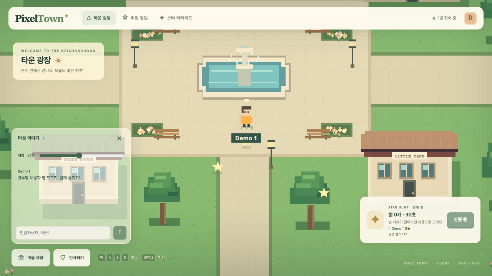
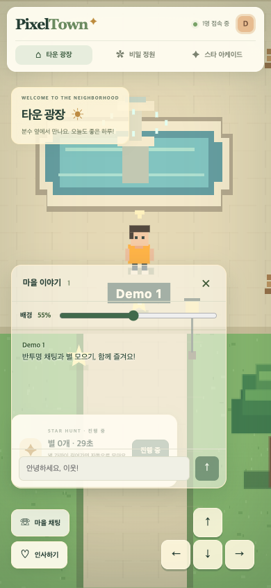
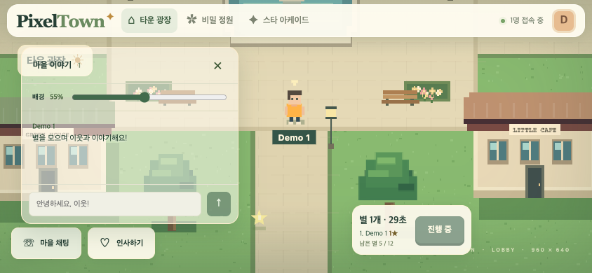
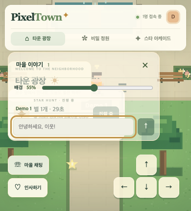
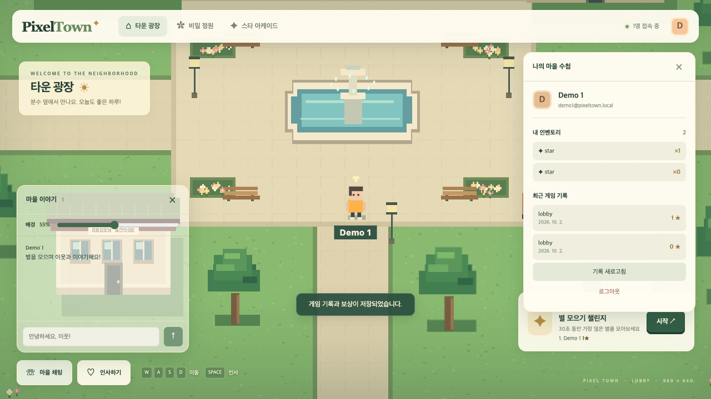

# 검증 증거

검증일: 2026-10-02 (Asia/Seoul). 게임 기반 리비전 `9bc3d66`과 후속 검증·표시 수정. 최신 진행 상태 정본은 [PROJECT_STATUS](03_PROJECT_STATUS.md)다.

## 서버

[통합 실행 기록](../tests/report.json): 13 passed / 0 failed. 별도 개발 DB와 outbox를 사용하고 자신의 프로세스만 중단·재시작했다.

| 확인 | 증거 |
|---|---|
| 두 계정·접속·이동 | 서로 다른 PB 사용자 ID, 같은 방 snapshot에 이동 반영 |
| 채팅·ID 사칭 | 다른 사용자에게 메시지 전달, 발신자는 인증 ID, 다른 플레이어 위치 변경 없음 |
| 방 전환 | 기존 방 이탈, 새 zone의 room ID 분리, 채팅 누출 없음 |
| 토큰·결과 권한 | 잘못된 토큰 401, 결과/보상 수정·삭제 403, 타 사용자 결과 조회 차단 |
| 미니게임 | 서버 점수 1, 사용자별 결과·보상 원장 1개 |
| 별 생성 | 초기5, 1500ms 주기, 미회수12 유지, 회수 후11→12, 새 ID, 최대12 |
| 중복·rollback | outbox·관리자 API 재전송 후 원장1개, 점수 충돌400, 잘못된 참가자 전체 rollback |
| 저장 장애 | PB 중단 시 디스크 queue, Colyseus 재시작 후 queue 유지, PB 복원 후 결과·보상 복구 |

단위 `npm --prefix colyseus test`: 6/6. 누적 생성 burst 방지, 빈 필드 진행·다른 방 독립·종료 후 생성 중단, 충돌과 outbox 복구, score>12 허용·전체64 초과 거부를 포함한다.

[독립 서버 추가 검증](../colyseus/verification-stars.json)은 별도 PB 18091·Colyseus 12568에서 실제 상한 유지·재생성과 13점 저장·65점 거부·rooms 메타데이터/권한을 확인했다. 테스트용 프로세스는 모두 종료했고 기본 개발 서버는 건드리지 않았다.

## 20명 로컬 smoke

같은 머신에서 20개 WebSocket 클라이언트, 600개 이동 입력, 약3초, 클라이언트당 실제9.96Hz. 최소 snapshot 30회, 채팅 전체 전달 p95 42ms, 동시 입장 약64ms였다. 실제 인터넷 지연이나 100명·장기 최대 수용량의 측정값이 아니다.

## 화면·상호작용

Playwright CLI로 두 별도 브라우저 로그인·presence·채팅을 확인했다. 접은 채팅에 미확인1 배지가 나타나고 펼치면 수신 메시지를 읽을 수 있었다. 투명도55%가 새로고침 후 유지되며 실제 background는 rgba(...,0.55), 텍스트/패널 opacity는1이다.

| 뷰포트 | document scrollWidth × scrollHeight | 확인 |
|---|---|---|
| 1280×720 | 1280×720 | 전체 게임·HUD·반투명 채팅 |
| 390×844 | 390×844 | 모바일 배치·방 메뉴·터치 패드·채팅 |
| 844×390 | 844×390 | 가로 화면·접기·게임 표시 |
| 390×430 | 390×430 | 키보드 상황을 가정한 높이 축소, 입력란이 화면 안에 위치 |

실제 모바일 OS 가상 키보드를 띄운 검증은 아니다. 실제 iPhone/Android 성능·키보드는 미실행이다.

기본30초 플레이에서 키보드로 별 수집(0→1), 순위·남은 별, 시간 종료, 저장 완료 안내, 수첩에 결과1점·보상1개 표시를 확인했다. 타이머 최초31초 표시를 수정한 뒤 30초 이하 표시도 확인했다. 초기 record 조회400은 created/updated 필드 누락을 보완·재seed한 뒤 오류0으로 확인했다.







## 재현

```sh
# 아직 바이너리를 준비하지 않았다면, 기본 개발 서버를 종료한 뒤:
npm --prefix colyseus run init
npm run test:integration
npm --prefix colyseus test
npm run build
# 기본 서버와 다른 포트에서 격리 검증:
node scripts/verify-stars.mjs
# 게임과 두 서버 시작:
npm run dev:all
```

브라우저 화면 확인은 루트 README의 두 계정 흐름을 따른다. 공개 원본 서비스에서는 부하·메시지 수집·재전송을 하지 않았다. 운영 PocketBase·Oracle·클라우드 인증·외부 공개 네트워크 설정을 변경하지 않았다.
