# 검증 증거 (재제작판)

검증일: 2026-10-02 (Asia/Seoul). 최초 증거는 브랜치 `cheng80/cyworld-remake`(`a714104`)에서 만들었고, main 병합(`965d266`) 후 main 체크아웃에서 단위·통합·UI·build를 다시 실행해 모두 통과했다. 1절 수치·5절 별 간격과 `docs/assets/` 스크린샷은 재확인 실행 값이다. 2–8절의 상세 좌표·문장은 최초 실행 기록이며 재실행 원값은 `tests/ui-report.json`에 있다(차이는 1도트 안팎). 1–4·6절은 PLAN-002 판(`12aefce`) 증거를 PLAN-003 코드로 다시 실행해 통과했다. 5·7·8절은 PLAN-003(상시 별 이벤트·별 상점·미니룸·클릭 이동) 증거다. PLAN-004에서 Colyseus 0.18로 올린 뒤 1절 자동 테스트와 UI를 다시 실행했다. Mac mini 원격 검증은 10절에 따로 적었다(로컬 결과와 섞지 않는다). 진행 상태 정본은 [PROJECT_STATUS](03_PROJECT_STATUS.md)다. 거절된 1차 판(`dc2e191`)의 화면 증거는 삭제했다.

실행 환경: 최초 검증은 재제작 worktree 전용 개발 서버(Vite 5273, PB 18190, Colyseus 12667), 병합 후 재확인은 main 체크아웃 기본 개발 서버(Vite 5173, PB 18090, Colyseus 12567). PLAN-004 이후 로컬 독립 모드는 Vite 5273, PB 18190, Colyseus 12667(5173은 원격 모드 프런트). 통합 테스트는 두 경우 모두 전용 서버(PB 18191, Colyseus 12668)와 임시 DB를 쓴다. 외부 접속은 PocketBase 공식 바이너리 다운로드(checksum 검증)와 원본 사이트 읽기 전용 관찰(MQTT 차단)뿐이다.

## 1. 자동 테스트

| 명령 | 결과 | 내용 |
|---|---|---|
| `npm --prefix colyseus test` | 18/18 | outbox·별 상한·정산·PB 훅 5개, 맵·깊이·충돌 9개, 상점 카탈로그·미니룸 규칙(화면·훅 대조)·미니룸 맵·look 4개. Colyseus 0.18 서버 기준. 0.16용 nanoid 대체 모듈 검사는 모듈과 함께 제거 |
| `PIXELTOWN_LOAD_100=1 PIXELTOWN_TEST_PB_PORT=18191 PIXELTOWN_TEST_GAME_PORT=12668 npm run test:integration` | 16/16 | [tests/report.json](../tests/report.json) — 기본 15개 + 100명 채널 분할 opt-in 1개. Colyseus 0.18·`@colyseus/sdk` 기준. 같은 훅으로 PB 0.39.7 바이너리(`PIXELTOWN_PB_BINARY`)에서도 15/15 |
| `CHROME_PATH=… PIXELTOWN_WEB_PORT=5273 PIXELTOWN_PB_PORT=18190 node tests/ui-check.mjs` | 7/7 | [tests/ui-report.json](../tests/ui-report.json), 스크린샷 `docs/assets/` |
| `npm run build` | 통과 | JS 501KB(gzip 159KB, `@colyseus/sdk` 0.18), Galmuri11 woff2 2개 671KB |

신규 단위 테스트(`colyseus/test/world.test.js`): 세 장소 모두 입구가 비어 있음, 걷는 8도트 칸 전부가 시작점과 연결(고립 0), 출입구 도달 가능, 세 맵의 타일·소품 구성이 서로 다름, 모든 footprint가 그림 안·그림 넓이 60% 미만·발선에 붙음, 나무 수관 아래 통과·밑동 차단, 건물 벽 바닥 차단·지붕 뒤 잔디 도달, 물·오락실 벽 차단·다리 횡단, 밑동 모서리 비켜가기, 오락기 섬 뒤 통과, 서버 입구 이름 검증(`__proto__` 등 거부).

통합 테스트 주요 수치(생성 1.5초·정산 30초로 단축): 별 5 → 생성 간격 1526–1532ms → 10.1초에 12개 → 3.1초간 12 유지 → 회수 후 572ms에 새 ID로 12 복귀, 12개일 때 별 사이 최소 거리 101도트, 정산 직후 같은 별로 다음 기간 계속. 점수 있는 사람만 결과 행(0점 행 0개). 20명 smoke: 입장 61ms, 입력 600개(클라이언트당 10.0Hz), snapshot 최소 59회, 채팅 p95 43ms. 단일 머신 짧은 기능 점검이며 수용량 측정이 아니다. 채팅 지연 값은 테스트의 40ms 폴링 해상도에 묶인다.

100명 로컬 측정(`PIXELTOWN_LOAD_100=1`, opt-in): 100명이 광장에 입장하면 채널 방 4개(32/32/32/4)로 자동 분할된다. 모든 클라이언트가 자기 방 인원만 정확히 본다. 입장 292 ms, 입력 3000개(클라이언트당 9.98 Hz), snapshot 최소 59회, 방 안 채팅 p95 42ms. 다른 채널 방 사람은 서로 보이지 않는다. 인터넷·운영 수용량 측정이 아니다.

## 2. 깊이·충돌 (AC-014) — 실제 브라우저에서 클릭 이동과 방향키로 확인

좌표는 서버가 확정한 발밑 위치다.

| 장면 | 서버 위치 | 결과 |
|---|---|---|
| 광장 나무(밑동 y≈179–183) 북쪽 | (148.1, 171.2) | 수관 아래로 걸어 들어감, 아바타가 수관에 가려지고 이름표만 보임 |
| 같은 나무 남쪽 | (147.2, 194.9) | 아바타가 나무 앞에 그려짐 |
| 남쪽에서 밑동으로 ↑ | (147.2, 187.4)에서 정지 | 밑동만 막힘 |
| 미니홈피 하우스 뒤 잔디 | (120.7, 48.7) | 지붕 그림 영역을 걸어 다님, 지붕에 가려짐 |
| 하우스 문 앞에서 ↑ | (120.5, 99.8)에서 정지 | 벽 바닥(footprint y 66–96)에서 막힘 |
| 오락실 오락기 섬 뒤 / 앞 | (108.6, 190.9) / (108.0, 221.9) | 뒤에서는 가려지고 앞에서는 앞에 보임 |
| 경품 카운터 뒤 | (539.6, 312.0) | 카운터에 하반신이 가려짐 |
| 오락실 북쪽 벽으로 ↑ | (321.1, 51.1)에서 정지 | 벽 타일(y<48) 통과 불가 |
| 정원 퍼걸러 아래 | (99.8, 216.7) | 격자 지붕(fg)이 아바타 위에 그려지고 틈으로 보임 |
| 정원 다리에서 연못으로 ↑ | (272.0, 195.3)에서 정지 | 물 타일 통과 불가 |

| 뒤 | 앞 |
|---|---|
| 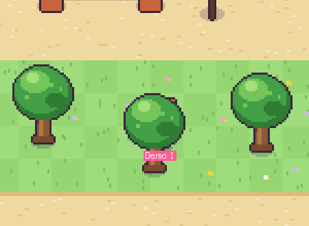 | 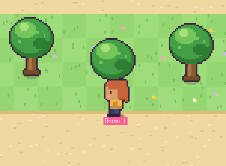 |
| 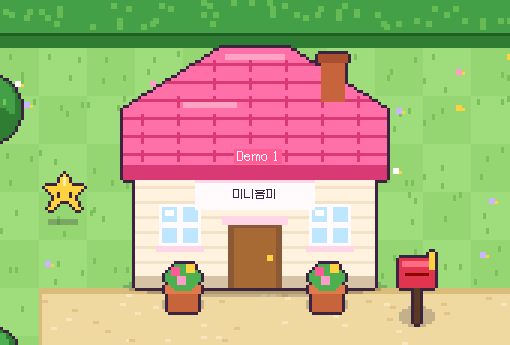 | 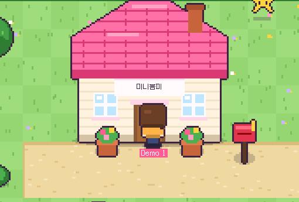 |
| 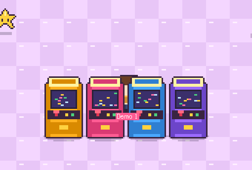 | 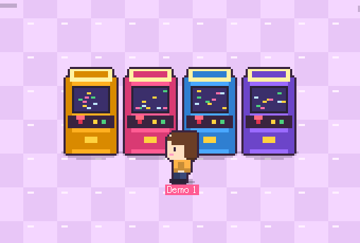 |
| 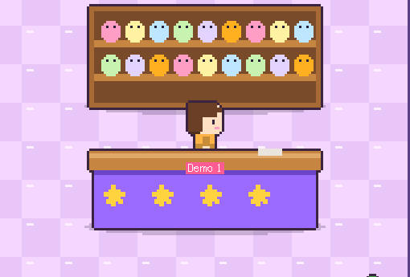 | 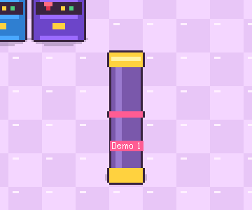 |
| 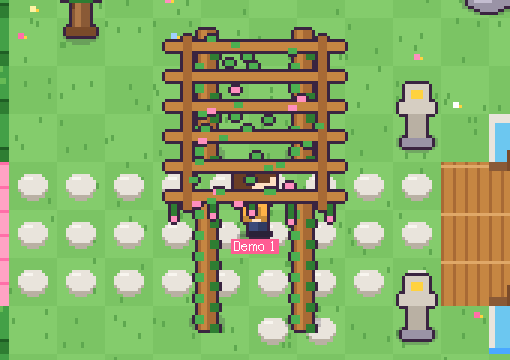 | 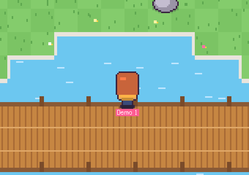 |

충돌 디버그 화면(`?debug=collision`): 파랑 = 그림 영역, 빨강 = 바닥 footprint·막힌 타일. footprint가 그림보다 훨씬 작다.

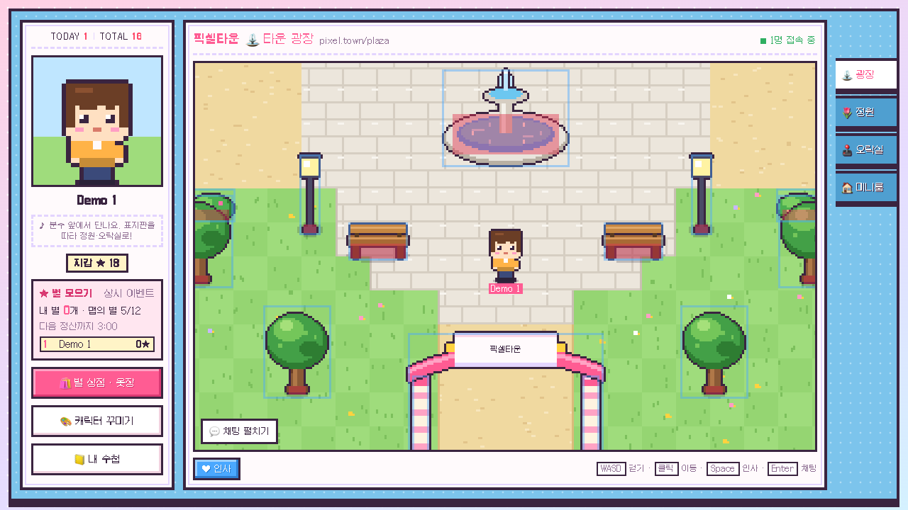
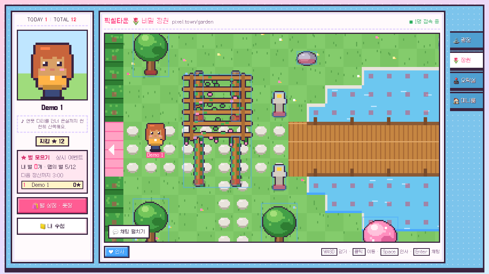

## 3. 장소별 맵 (AC-015)

| 광장 | 정원 | 오락실 |
|---|---|---|
| 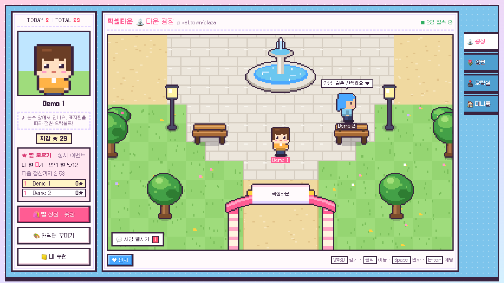 | 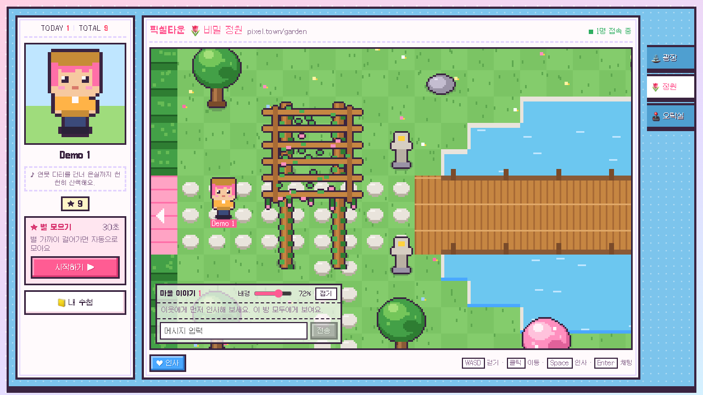 | 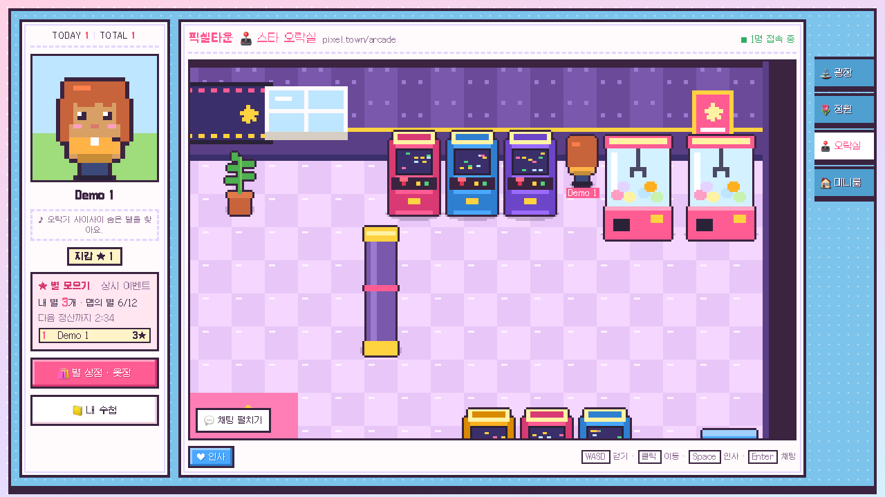 |

출입구 왕복: Demo 2가 광장 동쪽 매트를 밟아 정원 서쪽 입구(44, 218)에 도착, 이때 광장의 Demo 1 화면에서 사라짐. 정원 서쪽 매트로 돌아와 광장 동쪽 입구(596, 226)에 도착하고 두 사람이 다시 함께 보임.

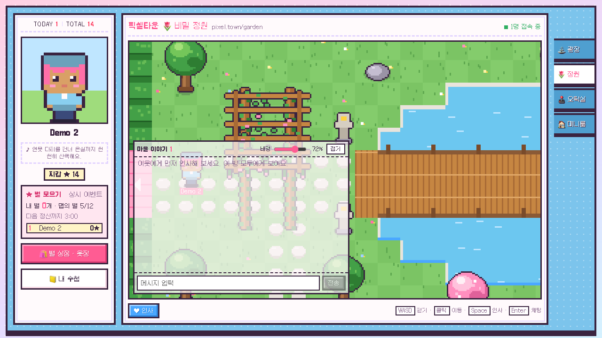

## 4. 두 사용자·채팅 (AC-003/004/005/006)

- Demo 2가 클릭 이동으로 (+40, −30) 이동 → Demo 1 화면의 Demo 2 위치가 같은 좌표로 동기화.
- Demo 2 채팅 → Demo 2 머리 위 말풍선, 접혀 있던 Demo 1에 미읽음 배지 1 → 펼치면 배지 사라지고 로그에 표시.
- 채팅 입력란에 `wasd`를 입력하는 동안 아바타 위치 변화 없음.
- 투명도 슬라이더 키보드 조작: 최소 20%, 최대 95%, 배경 `rgba(255,250,252,0.2)`, 로그 opacity 1. 75%로 바꾸고 새로고침하면 75% 유지, 펼침 상태도 유지.
- 새로고침 직후 이전 소켓 정리 전에 다시 들어가면 서버가 409를 줄 수 있다. 클라이언트가 700ms 간격으로 최대 6회 재시도해 해결했다. 같은 입구에 두 사람이 서면 서버가 16도트 옆 빈자리로 세운다.

## 5. 상시 별 이벤트 (AC-007/008/013) — 기본값(6초·3분), 단축 없음

Demo 1이 오락실에 들어가자 시작 버튼 없이 바로 진행 중이었다. 별 5개, 서로 최소 177도트 떨어짐. 13초 관찰 동안 5→7(6초마다 1개). 클릭으로 별 3개를 모아 서버 점수 3. 첫 정산까지 167초를 기다리자 "기록과 별 보상이 저장되었어요" 안내가 뜨고 이벤트는 계속 진행 중이었다. 수첩에 오락실 3점 기록과 별 보상이 보였다.

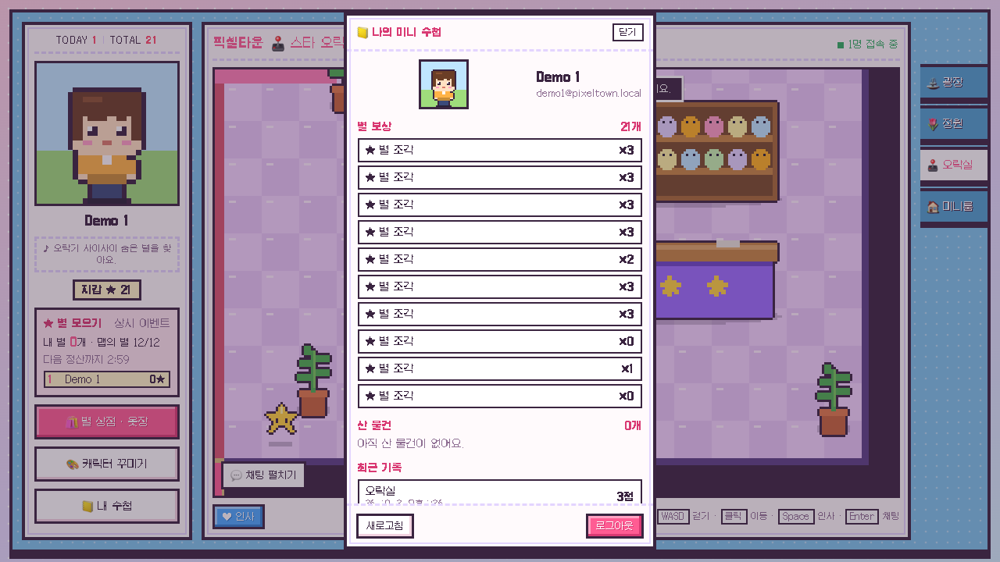

## 6. 화면 크기·도트 스케일 (AC-011/016)

| 뷰포트 | 문서 scroll | 장치 픽셀 배율 | 저해상도 월드 | smoothing | Galmuri | 방향패드 이동 | 채팅 전송 버튼 |
|---|---|---|---|---|---|---|---|
| 1280×720 | 1280×720 | 3 | 292×182 | false | 로드 | - | - |
| 390×844 (DPR3) | 390×844 | 6 | 166×332 | false | 로드 | +33 | 화면 안 |
| 844×390 (DPR3) | 844×390 | 6 | 352×127 | false | 로드 | +36 | 화면 안 |
| 390×430 (DPR3) | 390×430 | 6 | 166×125 | false | 로드 | +36 | 화면 안 |

캔버스 폭 ÷ 배율의 올림이 저해상도 폭과 같아 정수배 확대만 쓴다. 1280×720 미니룸에서 보이는 월드는 292×182도트로 원본(800×500 캔버스 ÷ 3배 ≈ 266×166)과 비슷한 밀도다.

| 데스크톱 | 모바일 | 모바일 채팅 |
|---|---|---|
| 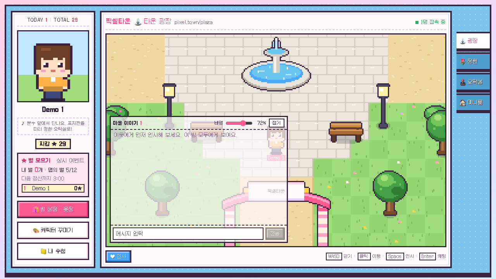 | 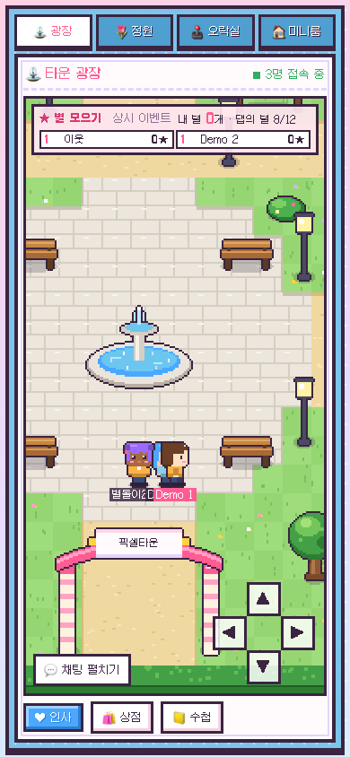 | 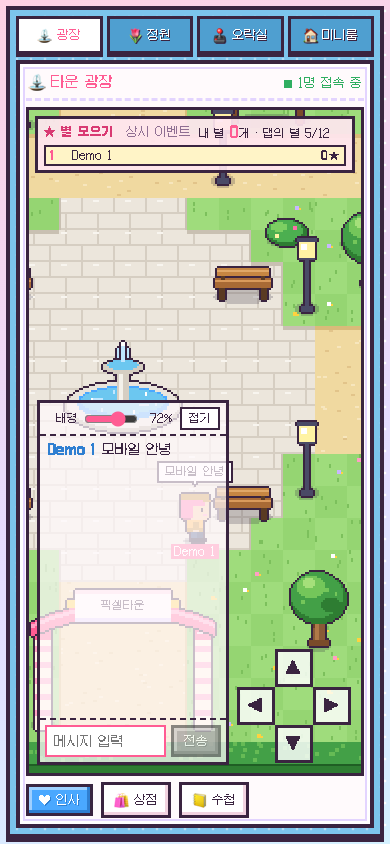 |

| 가로 | 가로 채팅 | 낮은 높이 | 낮은 높이 채팅 |
|---|---|---|---|
| 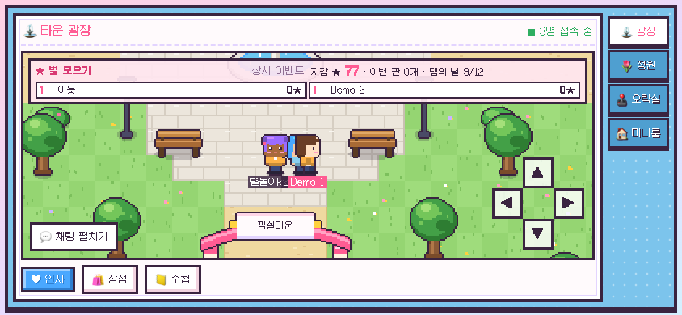 | 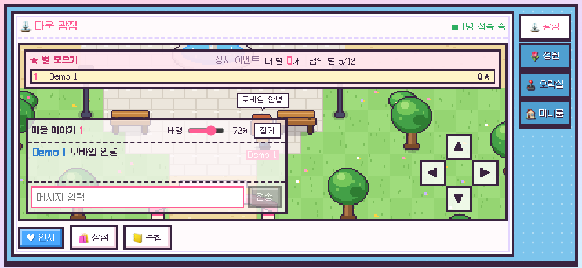 | 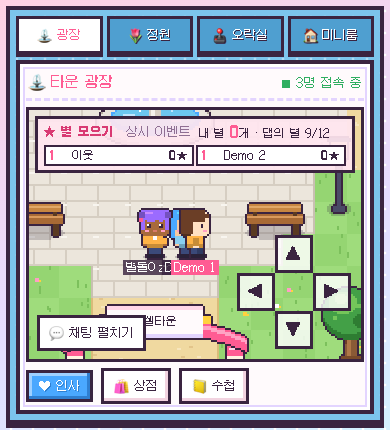 | 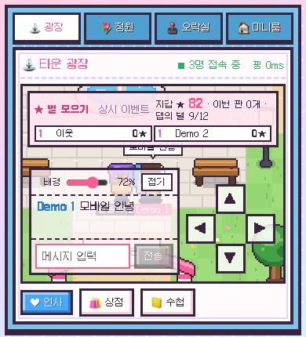 |

입장 화면:

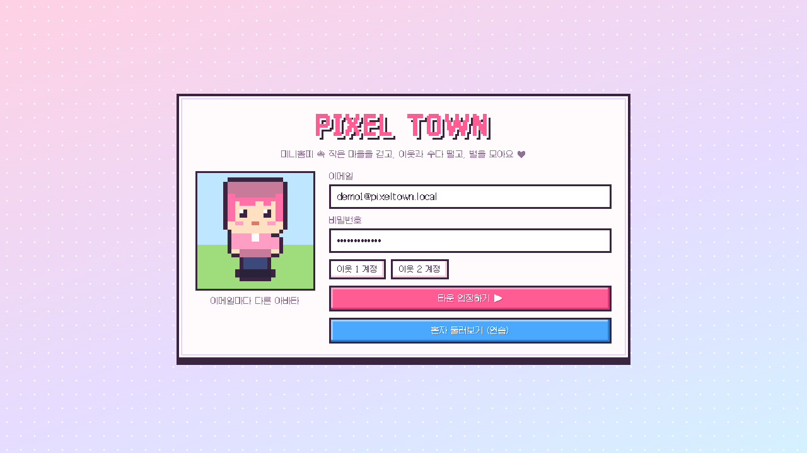

## 7. 클릭 이동·큰 채팅창 (AC-020)

- 펼친 채팅 로그 위를 클릭하자 경로가 생기고 목적지 표시가 떴다. 경로의 모든 직선 구간은 `clearWalk` 충돌 없음(string pulling 최단 경로). 광장 별 후보 칸 50쌍으로 따로 계산한 경로 길이는 직선 거리의 평균 1.025배, 경로 하나 0.38ms였다.
- 이동 중 ↓ 키를 누르자 경로와 목적지 표시가 모두 사라졌다.
- 미니홈피 하우스 지붕(막힌 곳)을 클릭하자 목적지가 문 앞 (124, 100)으로 잡히고 그 자리에 멈췄다.
- 채팅창은 데스크톱 460×400(미니룸 높이 60%), 작은 화면 55% 높이다.

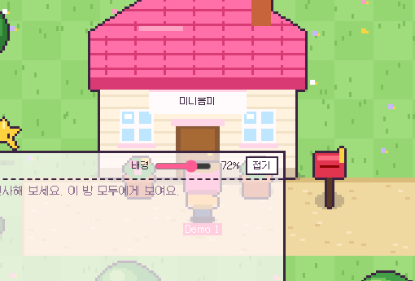

## 8. 별 상점·옷장·미니룸 (AC-017/018/019)

통합(별도 PB):
- 지갑 40 → 왕관(30) 구매 후 잔액 10. 같은 물건 재구매 400, 별 0인 사용자 구매 400(원장 행 없음), 익명 401, 없는 아이템 400.
- 잔액 10에서 6·8·10별 물건을 동시에 3건 구매 → 1건만 성공, 잔액 4(음수 없음).
- 사용자가 purchases 직접 생성·삭제 403, 남의 구매 조회 404. 프로필 outfit/room 직접 PATCH 403.
- 다른 슬롯·미보유 장착 400. 상대 화면에 왕관이 서버 프로필 기준으로 보이고, 벗은 뒤 `look` 메시지에 클라이언트가 보낸 옷 값은 무시됨.
- 미니룸 배치: 미보유·바닥 밖·문 앞·겹침·중복 모두 400, 침대·러그·의자(러그 위) 저장 성공.

브라우저(임시 계정, 별 120 지급):
- 상점에서 왕관·세일러복·강아지·침대·러그·소파·화분 구매 → 지갑 120 → 16. 입기·데리고 다니기 후 다른 사용자(Demo 2) 화면에 `{hat:hat_crown, top:top_sailor, pet:pet_puppy}`.
- 미니룸에서 가구 4개 배치, 문 앞에 화분을 놓으려 하자 "문 앞은 비워 두어야 해요." 안내, 저장 후 새로고침해도 4개 유지. 페이지 오류 0.

| 상점·옷장 | 내 모습(펫) | 상대 화면 |
|---|---|---|
| 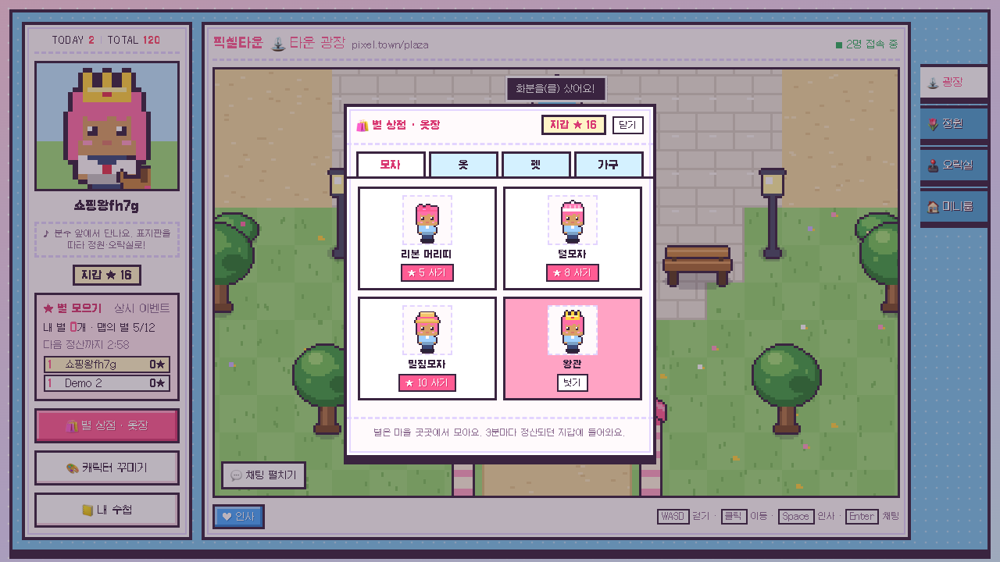 | 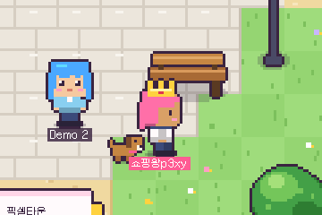 | 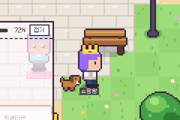 |

| 미니룸 배치 중 | 저장한 미니룸 |
|---|---|
| 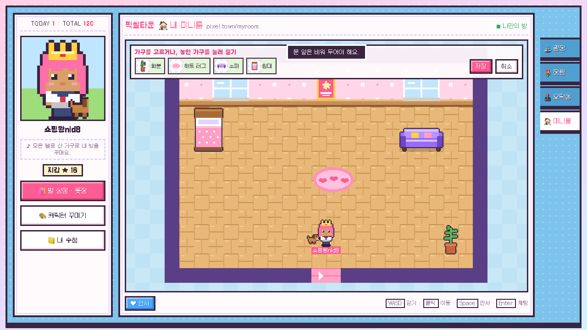 | 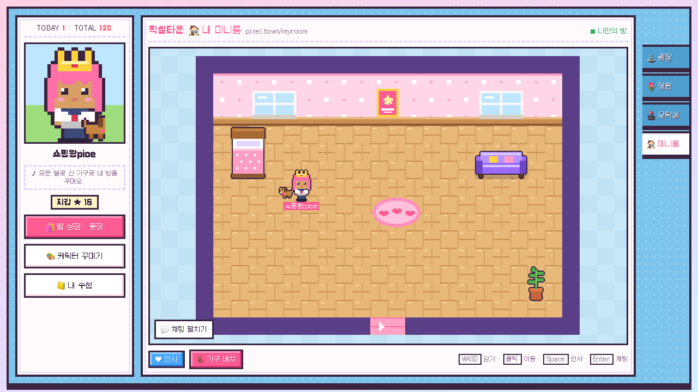 |

## 9. 미실행·한계

- 실제 iPhone/Android 기기, OS 가상 키보드, 저사양 기기 FPS는 확인하지 않았다. 브라우저 모바일 에뮬레이션(DPR3, touch)만 사용했다.
- 미니룸 캡처에서 펫이 주인 몸 뒤에 완전히 가리던 문제(정면을 볼 때 펫 목표가 주인 바로 북쪽)를 고쳤다. UI 검사가 정면 방향 펫 오프셋(dx −14)을 단언한다.
- 클라이언트 예측이 없다. localhost에서는 50ms 틱 보간으로 충분했지만 인터넷 지연 환경의 조작감은 측정하지 않았다.
- 디자인은 2026-10-02 사용자가 승인했다(배포 주소 화면 기준). 위 스크린샷은 참고 자료다.
- 연습 모드(혼자 둘러보기)는 이동·별 생성·연습 점수만 확인했고 서버 기록은 만들지 않는다. 연습 모드에는 상점·미니룸이 없다.
- 다른 사람의 미니룸 방문은 범위 밖이다. 미니룸은 자기 브라우저에서만 걷는다.
- 브라우저 상점 검증은 개발 DB에 임시 계정(`ui-*@pixeltown.local`)과 지급 별을 남긴다.

## 10. Mac mini 원격 검증 (PLAN-004, 2026-10-02)

로컬 결과(1–9절)와 별개인 원격 증거다. 대상은 Mac mini PocketBase 0.39.7(`https://pixeltown.fastmake.net`, 내부 8091)과 Colyseus 0.18.18(`wss://pixeltown-rt.fastmake.net`, 내부 2567)이다. 서버 배치·백업·롤백은 [SERVER_OPERATIONS](SERVER_OPERATIONS.md) 6절에 있다. 원본은 [tests/remote-report.json](../tests/remote-report.json)이며 자격증명·토큰은 기록하지 않았다. 계정은 무작위 암호 테스트 계정 2개(Tester 1/2)다.

| 검사 | 결과 |
|---|---|
| 인증·위조 (`node tests/remote-check.mjs`) | 잘못된 토큰·토큰 없음 입장 401, `/me` 토큰 200·없음 401, 타인 프로필 0건, 프로필 PATCH 403, 결과·구매 직접 생성 403, 사용자 토큰 `commit-match` 403, 미로그인 결과 조회 0건. 가입 차단 후 공개 가입 요청 403 |
| 2유저 이동·채팅 | 상대 화면에서 30도트 이동 확인. `id`를 위조한 채팅도 서버가 발신자를 실제 사용자 ID로 바꿈 |
| 장소 분리 | 광장 1명·정원 1명, 광장 채팅이 정원에 전달되지 않음 |
| 별 이벤트(기본 6초) | 시작 5개 → 12개 상한, 상한에서 8초 동안 최대 12, 10개 회수(서버 점수 10), 새 ID로 보충 |
| 기본 3분 정산 | 다음 기간 `endsAt` − 정산 시각 = 179,838ms. 결과 점수 10·별 보상 10 저장, 다른 사용자는 조회 0건, 별은 다음 기간으로 유지 |
| 상점·미니룸·재로그인 | 1회차: 지갑 10 → 리본 모자(5)·의자(4) 구매 후 1. 가입 차단 후 재실행: 아직 없는 가장 싼 모자·가구(비니·화분)를 골라 23 → 11. 중복 구매·잔액 부족·미보유 장착·문 앞 배치 400. 의자 (11,10) 저장. 상대가 모자를 봄. 새 로그인에서 outfit·room·입장 look 복원 |
| Monitor | 미로그인·게임 사용자 Basic·오답 모두 401 |
| 멱등·원자성 (Mac mini에서 `tests/remote-persistence.mjs`) | 같은 결과 재전송 200 후에도 results·inventory 각 1행, 다른 점수 재전송 400, 없는 두 번째 참가자 포함 배치 404·기록 0행(롤백) |
| outbox 장애·재시작 (`PIXELTOWN_REMOTE_OUTAGE=1`) | 정산 주기를 30초로 줄이고 1점 수집 → PB 중단(공개 502) → 정산이 디스크 outbox 1건으로 남음 → Colyseus 재시작 후에도 pending 1 → PB 복귀 후 saved, 점수 1 저장. 끝에 단축값 제거·PB 기동 확인. 이후 화면 HUD가 "다음 정산까지 2:57"로 기본값 복귀를 보임 |
| 로컬 프런트 원격 모드 (`npm run dev:remote`, `node tests/remote-ui.mjs`) | 5173에서 2유저 로그인·같은 방·채팅. 요청 대상 `https://pixeltown.fastmake.net`, `wss://pixeltown-rt.fastmake.net`. 페이지 오류 0 |

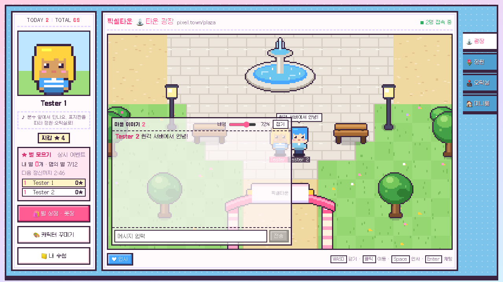

가입 차단 뒤 원격 검증을 다시 실행했다. 첫 재실행은 상점 검사만 실패했다. 1회차에 이미 산 리본 모자를 다시 사려다 400(중복 구매 거부, 서버 정상)이 난 것이다. 매 실행마다 미보유 품목을 고르도록 테스트를 고친 뒤 7/7 통과했다(정산 주기 179,771ms). outbox 복구·서버 측 멱등 결과는 같은 코드 경로의 이전 실행 값을 보고서에 병합했다.

초기 실패와 수정: 원격 UI 스크립트의 채팅 확인이 접힌 채팅창 때문에 두 번 시간 초과했다(서버 문제 아님, 두 브라우저는 같은 방에 있었다). outbox 시험 스크립트는 상수 초기화 순서 오류로 한 번 원격 변경 없이 중단했고, 한 번은 끊긴 방의 `leave()`가 멈춰 보고서를 쓰지 못했다(저장은 완료). 수정 후 각각 통과했다.

미검증: 공개 경로 부하(정책상 금지, 100명은 로컬만), 관리자 계정으로 Monitor 화면 로그인(관리자 암호를 쓰지 않음), 실제 모바일 기기, 원격에서 진행 중 경기의 강제 종료 복원(설계상 미지원).

## 11. 캐릭터 만들기·닉네임 유일성·경로 수정 (PLAN-005, 2026-10-02)

로컬(5273/18190/12667, 통합 18191/12668)과 원격(Mac mini)을 구분해 적는다.

| 검사 | 로컬 | 원격 |
|---|---|---|
| 단위 `npm --prefix colyseus test` | 20/20: 캐릭터 값 허용·거부(예약어 포함), `lookOf` 색인, 세 장소의 막히지 않은 표본 위치 모두에서 입구까지 서버 이동으로 도착 | — |
| 통합 | 17/17(PB 0.40.4, 100명 포함), 16/16(PB 0.39.7). `character_setup_profile_rules`: 미로그인 401, 짧은 이름·마크업·색·피부 400, 중복 닉네임 400("이미 쓰는 닉네임이에요. 다른 이름을 지어 주세요." + `data.name`), 대소문자 변형 400, 다른 사용자 snapshot에 이름·외형·옷 색 반영 | — |
| 브라우저 | 8/8. `character_setup_first_entry`: 새 계정은 방 입장 전 캐릭터 화면, 짧은 이름이면 버튼 비활성, `demo 1`(대소문자만 다른 기존 이름) 입력 시 입력칸 아래 안내·`aria-invalid`, 저장 후 입장, 상대 화면 반영, 게임 안 수정(이름·옷 색) 반영 | `tests/remote-ui.mjs`: Tester 2명 모두 첫 입장 화면 표시 후 입장, 페이지 오류 0 |
| 기능·보안 `tests/remote-check.mjs` | — | 8/8. `character_setup_profile`: 미로그인 401, 잘못된 색 400, 저장 200, 다른 사용자의 같은 닉네임 400, 상대에게 외형 반영. 별 10개 회수, 기본 정산 179,928ms. 상점은 반복 실행용으로 살 수 있는 미보유 품목(하트 티셔츠·램프)을 골라 21 → 9 |
| Monitor | — | outbox 서비스 계정 Basic 인증 401(관리 화면 차단), 같은 계정의 PB superuser 인증 200(결과 저장 유지) |
| 빌드 | vendor 221KB + 앱 283KB(gzip 68 + 93KB), 500KB 경고 없음 | — |

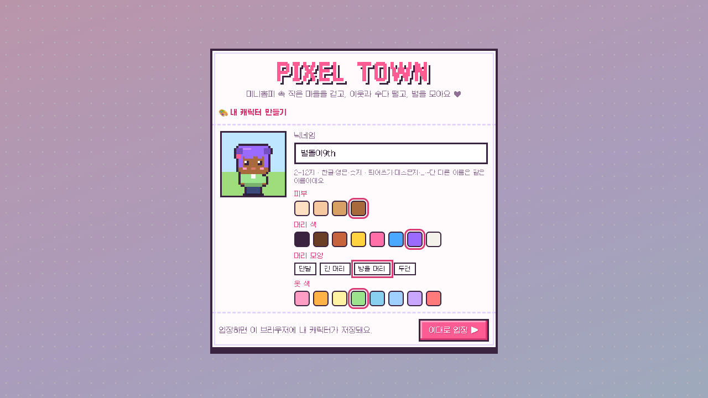
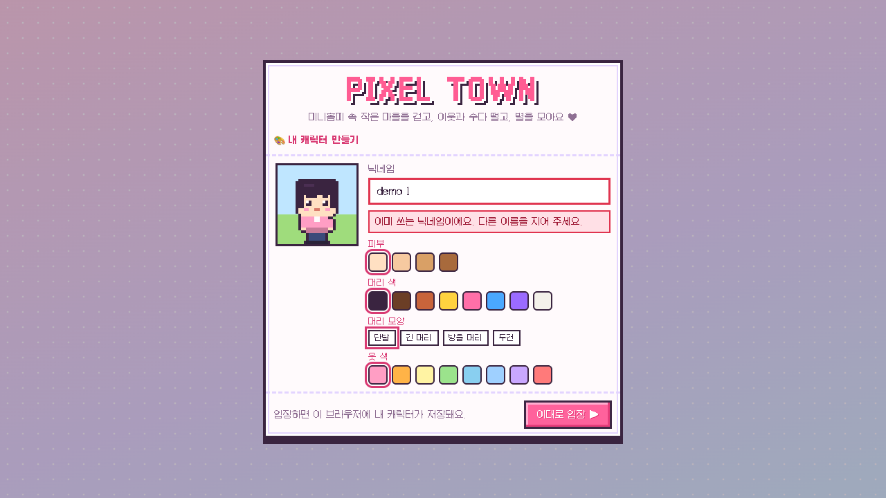
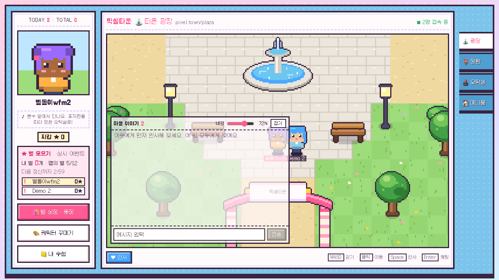

### 원격 별 회수 실패 조사

- 증상: 원격 `star_cap_collect_and_refill`이 `walk timeout`으로 실패했다. 같은 검사가 앞선 실행에서는 통과했다.
- 재현: 원격에서 별까지 걷기를 반복하자 5개 중 2개, 5개 중 1개가 25초 안에 도달하지 못했다. 로컬에서는 5/5 도달했다. 입력→이동 지연은 원격 97–214ms, 로컬 35ms였다.
- 원인 1: 플레이어가 소품 가장자리처럼 실제로는 서 있을 수 있지만 8도트 격자 칸 중심이 막힌 곳에 서면, `findPath`가 빈 경로를 반환했다. 예: 오락실 (233.8, 371.6), 광장 (616.2, 21.8). 테스트는 직선으로 걷다 오락기에 끼었다. 실제 화면에서는 그 자리에서 클릭 이동이 반응하지 않는다. 원격에서는 지연 때문에 이런 위치에 멈출 일이 많아 원격에서만 드러났다.
- 원인 2: 위치 반올림으로 웨이포인트와 0.03도트 어긋나면 `moveActor`의 모서리 비켜가기 조건(`!sx`)이 꺼져 모서리에 멈췄다. 예: 광장 (419.97, 177.29) → (420, 196).
- 수정: 시작 칸을 직진 가능한 가장 가까운 걷는 칸으로 고르고, 문자열 당김이 시작점에서도 직진 여부를 검사한다. 비켜가기는 거의 축 방향(다른 축 성분 25% 미만)일 때도 동작한다. 클라이언트는 클릭 이동 중 0.5초 동안 움직이지 않으면 현재 위치에서 경로를 다시 찾는다.
- 확인: 단위 회귀 테스트(위 표), 원격 걷기 진단 10/10 도달(지연 82–91ms), 원격 검사 8/8.
- 연쇄 실패 정리: 같은 회차에서 상점 검사는 반복 실행으로 싼 미보유 품목이 떨어져 실패했고(서버 정상), 캐릭터 검사는 그 때문에 상대가 다른 방에 남아 실패했다. 두 검사를 각각 독립적으로 동작하게 고친 뒤 통과했다.
- 기타: 통합 테스트 셋업이 한 번 0.6초 만에 "Something went wrong."로 실패했다. 이후 통합 테스트 4회 연속 통과해 재현되지 않았고 원인은 확인하지 못했다.

## 12. 남은 문제 1·2·3 조치 (2026-10-02)

| # | 문제 | 원인 확인 | 조치 | 검증 |
|---|---|---|---|---|
| 1 | 통합 셋업이 한 번 0.6초 만에 "Something went wrong." | 셋업 순서 20회 반복으로는 재현되지 않았다. PB 실행 중 훅 파일을 바꾸면 PB가 스스로 재시작하고, 약 2–3초 동안 요청이 정확히 "Something went wrong. status=0"으로 실패했다(4초 동안 성공 85, 실패 322). 테스트 PB가 저장소 훅 폴더를 직접 감시하고 있었다 | 통합 테스트가 실행 폴더에 훅·카탈로그 사본을 만들어 쓴다. 실패 보고에 status·URL을 남긴다. 원격 배포 문서에 훅 변경 시 짧은 중단을 적었다 | 통합 17/17(0.40.4·100명), 16/16(0.39.7) |
| 2 | 원격 실제 브라우저 클릭 이동 미측정 | `tests/remote-click.mjs`로 측정했다. 로컬 10/10 도착, 원격 10번 중 4번은 목표를 6–7도트 지나쳐 멈추거나 왕복(반전 12회)했다. 클라이언트가 늦은 snapshot으로 도착을 판정하는 사이, 서버는 직전 방향으로 계속 움직였다 | 마지막 구간 입력에 `to`를 보내, 서버가 실제 위치에서 같은 속도·충돌 규칙으로 목표까지 가서 멈춘다. 단위 테스트: 늦은 같은 입력이 반복돼도 목표 좌표에서 정지, 한 틱 이동은 3도트 이하 | 원격 20/20 도착, 반전 0–1, 끝 오차 0–1.8도트, 이론 대비 +77–404ms. 로컬 10/10 |
| 3 | 띄어쓰기만 다른 닉네임 허용 | `name COLLATE NOCASE`는 대소문자만 무시했다 | 식 인덱스 `idx_profiles_name_key = lower(replace(replace(replace(name,' ',''),'_',''),'-',''))`. PB 0.39.7·0.40.4 모두 허용과 강제를 확인했다. 시드가 같은 키의 기존 중복에 번호를 붙인다. 안내 문구 "띄어쓰기·대소문자·_·-만 다른 이름은 같은 이름이에요" | 통합: `S tar…`·`Star_…`·`st-ar…` 400. 원격 인덱스 적용, 이름 변경 0건(직전 백업 `pixeltown-nickname-key-20261002`) |

같은 회차 회귀: 단위 21/21, build, 로컬 UI 8/8, 원격 기능 8/8, 원격 UI(Tester 2명) 통과, 원격 보고서 `tests/remote-report.json`(클릭 이동 요약 포함), `tests/remote-click-report.json`.

## 13. 첫 화면 캐릭터 만들기 + 게스트 자동 가입 (PLAN-006, 2026-10-02)

| 검사 | 로컬 | 원격 |
|---|---|---|
| 통합 | 17/17(PB 0.40.4·100명), 16/16(PB 0.39.7). 게스트 발급 200·`@guest.pixeltown.local`·같은 비밀번호로 재로그인·광장 입장, 이미 쓰는 닉네임(띄어쓰기 변형)·짧은 비밀번호·사칭 단어 400, 거부 시 사용자 수 변화 없음 | — |
| 브라우저 | 8/8. `character_setup_first_entry`: 첫 화면에 이메일·비밀번호·연습 버튼 없음, 중복 닉네임 안내, 저장 후 입장·`localStorage`에 게스트 자격증명, 새로고침하면 같은 캐릭터로 바로 입장, 상대 화면 반영, 게임 안 수정 반영 | `tests/remote-ui.mjs`: Tester 2명이 저장 자격증명으로 입장. 새 방문자가 캐릭터 화면 → 게스트 계정 → Tester 1 화면에 보임 → 새로고침해도 같은 캐릭터, 페이지 오류 0 |
| 기능·보안 | — | `tests/remote-check.mjs` 8/8(공개 `users` 직접 가입 403 유지) |
| 클릭 이동 | — | `tests/remote-click.mjs` 10/10 도착, 끝 오차 최대 1.5도트 |

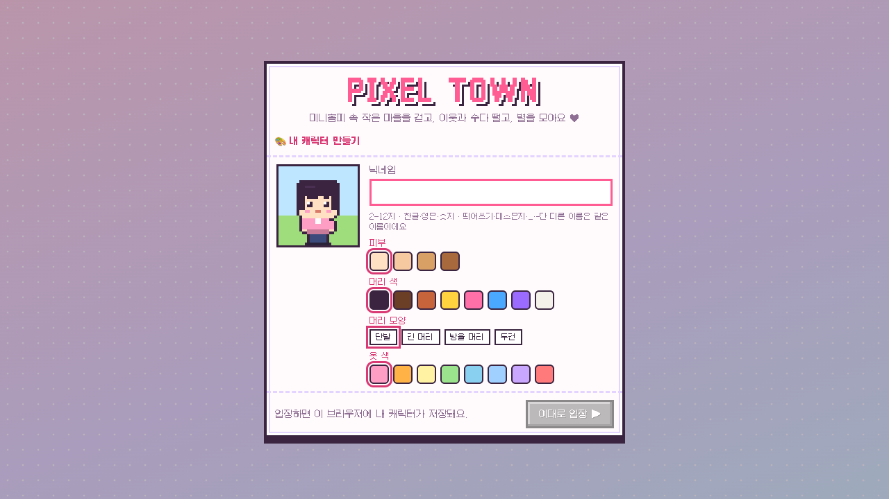

원격 반영 전 백업 `pixeltown-guest-20261002`(DB·`pb_hooks`). 원격 검증으로 게스트 계정이 실행마다 1개씩 생긴다(정리 정책 미정).

## 14. 게스트 남용 방지 (PLAN-006 5절, 2026-10-02)

| 검사 | 로컬 | 원격 |
|---|---|---|
| 통합 `guest_abuse_limits_and_cleanup` | 0.40.4·0.39.7 모두 통과. `applyAbuseLimits` 적용 후 같은 프록시 IP는 6번째 요청에 429, 다른 IP·loopback(게임 서버)은 400(정상 처리), 로그인 시 `last_seen` 기록, 40일 묵은 게스트만 삭제(1), 활동 게스트·일반 계정 유지, 미인증 정리 요청 401 | — |
| 전체 회귀 | 단위 21/21, 통합 18/18(0.40.4·100명), 17/17(0.39.7), UI 8/8, build | 기능 8/8, 원격 UI(게스트 생성·재방문), 클릭 이동 10/10 — 제한을 켠 상태에서 통과 |
| 설정·운영 | 로컬 개발 PB는 제한 끔(테스트 반복용) | `rateLimits.enabled`, 게스트 규칙 시간당 5회, PB 기본 규칙, `CF-Connecting-IP` 신뢰, loopback 제외 확인. 로그에 실제 방문자 IP(`219.251.x.x`), Colyseus 요청은 127.0.0.1. Tester `last_seen` 기록. 정리 30일 0건. 이 PC IP에서 5번째 발급 요청 뒤 429, 다른 API 200. 확인 뒤 PB 재시작으로 카운터 초기화 |

반영 전 백업 `pixeltown-abuse-limits-20261002`(DB·`pb_hooks`).

게스트 발급 한도 상향(사용자 지시): 시간당 5회 → 20회. 통합 `guest_abuse_limits_and_cleanup`에서 같은 IP 20번까지 400(정상 처리), 21번째 429. 원격 배포 후 규칙 `POST /api/pixeltown/guest` `maxRequests: 20`, `enabled: true`, `CF-Connecting-IP` 확인. 원격에서 21회 요청 시험은 이 PC IP를 1시간 막기 때문에 하지 않았다(규칙 동작은 5회 기준으로 원격 확인 완료).

## 15. 주소 이전·Pages 배포·부드러운 이동 (2026-10-02)

주소: 게임 https://pixeltown.fastmake.net(Cloudflare Pages `pixeltown`), PB https://pixeltown-pb.fastmake.net, Colyseus wss://pixeltown-rt.fastmake.net. 절차와 되돌리기는 SERVER_OPERATIONS 10절.

| 검사 | 결과 |
|---|---|
| 터널 경로 `pixeltown-pb` 추가 | Mac mini·외부에서 `/api/health` 200. 이 Mac은 앞서 조회 실패한 결과가 mDNSResponder에 약 1시간 남아 `ENOTFOUND`가 났다(상위 DNS는 정상). 대기 중에는 테스트에 IP 고정 우회를 썼고, 지금은 해소됐다 |
| Pages 첫 배포(`8740186`) | 성공. 빌드에 `pixeltown-pb`·`pixeltown-rt` 주소 확인. 사용자 지정 도메인 활성 후 `https://pixeltown.fastmake.net`이 게임 HTML 제공(이전 PB JSON 아님) |
| Colyseus Origin | `https://pixeltown-4x2.pages.dev` 추가 후 200 |

부드러운 이동(`tests/motion-check.mjs`, 방향키 2초, 프레임마다 측정, 원격은 같은 Tester 계정):

| 환경 | 화면 위 아바타 위치(값 개수) | 프레임 이동량 변동계수 | 멈춤/튐 |
|---|---|---|---|
| 원격, 수정 전 클라이언트(배포본) | 5–6개(떨림) | 0.44–0.45 | 0/0 |
| 원격, 수정 후(5173 원격 모드) | 1개(고정) | 0.19–0.24 | 0/0 |
| 로컬 5273, 수정 후 | 1개 | 0.21–0.22 | 0/0 |

회귀(수정 후): 단위 22/22(한 입력 = 한 걸음, `ack`, 빠르게 보내도 1틱 1걸음, 지연 입력이 목표를 지나치지 않음), 통합 18/18(0.40.4·100명), 17/17(0.39.7), UI 8/8, build, 원격 기능 8/8(새 서버, PB `pixeltown-pb`).

배포 주소 최종 확인(`96c114a` Pages 배포 후, https://pixeltown.fastmake.net): 흔들림 측정 2회 모두 화면 위치 1개·튐 0(변동계수 0.15–0.20, 5173 원격 모드와 같음). 배포 직후 첫 측정 1회는 실패(화면 위치 6–14개)했는데, CDN이 이전 파일을 섞어 내보낸 시점으로 보이며 재측정에서 재현되지 않았다. 원격 UI 통과(실제 방문자 "cheng"이 같은 방에 있어 "정확히 2명" 조건을 "상대 Tester가 보임"으로 고침), 게스트 생성·재방문 통과, 클릭 이동 10/10(끝 오차 최대 2.9도트).

대각선 스프라이트 방향(사용자 지적: 대각선 이동 때 스프라이트가 빠르게 바뀜): 가로·세로 2:1 안쪽 대각선은 옆모습으로 고정하고 이동 방향을 최근 프레임 평균으로 판정. `tests/motion-check.mjs` 대각선(→+↓) 2초 동안 방향이 바뀐 횟수: 수정 전 배포본 6회 → 수정 후 0회(원격 5173·로컬 5273). 직선 이동 화면 고정 유지, 단위 23/23(`facing` 경계 포함), 로컬 UI 8/8, build.

## 16. 운영 정리와 관리자 검증 (2026-10-02)

- 원격 검사 8/8: 실제 방문자가 같은 방에 있는 상태에서 통과. 인원수 대신 상대 Tester가 보이는지로 판정한다. 별 검사는 남은 정산 시간이 2분 30초 미만이면 다음 주기를 기다렸다가 시작한다. 이전 실패 3건(정확한 인원수, 이미 돌고 있던 정산 주기)의 원인이 이것이었다.
- 관리자 Monitor: 검증용 superuser로 화면 200("Colyseus Stats"), API `/monitor/api` 200(방 목록), 다른 Origin 403. 미로그인·게임 사용자·오답 401 유지.
- 정리 후 재배포: 루트 package·node_modules 없이 `app/package.json`으로 정상 기동, 내부 health·`/health/pocketbase` 정상, 배포 주소 원격 UI 통과(게스트 생성 후 자동 삭제 204). 첫 실행은 같은 IP의 로그인 속도 제한에 정리용 관리자 인증이 걸려 실패해, 429면 재시도하고 실패해도 검사 결과에 영향 없게 고쳤다.
- 로컬: 개발 DB 테스트 계정 23개 삭제(demo1·demo2 유지), 정리 직전 백업 `pocketbase/.local/pb_data.backup-20261002-cleanup`. UI 검사(상점·캐릭터) 뒤 자동 정리로 2개 삭제 확인.

## 17. 별 수집 히트박스·서버 자동 수집 (2026-10-02)

- 사용자 피드백: 별 중심까지 가야 먹히고, 먹는 반응도 느리다.
- 원인: 클라이언트가 화면(예측) 위치로 범위 안이라고 보고 `collect`를 보내면, 원격 지연만큼 뒤에 있는 서버 위치로 거절됐다. 클라이언트는 600ms 뒤에야 다시 보냈다. 판정도 발밑–별 기준점 거리라 별 그림(기준점 3–16도트 위)과 맞지 않았다.
- 수정: 몸 상자–별 그림 상자 겹침 판정, 서버 매 틱 자동 수집, 화면은 닿는 순간 숨김과 효과. TECH_SPEC 마지막 절.
- 로컬: 단위 24/24(히트박스 경계·tick 자동 수집 추가), 통합 17/17(18191/12668), UI 8/8(5273), build 성공.
- 원격(Mac mini 배포 후): `tests/remote-check.mjs` 8/8. `tests/remote-pickup.mjs`(dev:remote, 방향키로 별 5개): 모두 화면에서 닿는 순간 숨김, 서버 snapshot 확인까지 160–297ms, 다시 나타난 별 0개. 숨김 시점의 발밑–별 차이 (12,18)·(-1,21)·(-14,11)·(1,-14)·(0,-16)으로 몸 가장자리가 별 그림에 닿을 때 먹었다(소수 위치 반올림).
- 배포 주소(`https://pixeltown.fastmake.net`, Pages 자동 빌드 반영 후): `BASE=https://pixeltown.fastmake.net/ node tests/remote-pickup.mjs` 5/5, 서버 확인 219–292ms, 다시 나타난 별 0개.

## 18. 연결 끊김 차단·자동 재접속·불안정 연결 떨림 (2026-10-02)

- 사용자 피드백: 연결이 끊겨도 이동이 됐다. 끊기면 재접속 안내만 띄우고 다른 동작을 막아야 한다. 오락실에서 접속이 불안정하면 화면이 많이 떨린다.
- 끊김 원인: 서버가 재접속을 허용하지 않았고 SDK는 약 50초 동안 재시도하면서 "접속 중" 상태를 유지했다. 그 사이 클라이언트 예측만으로 캐릭터가 움직였다.
- 떨림 원인: 서버 입력 대기열 상한이 6이었다. 불안정한 연결에서 몰려 도착한 입력이 버려져 서버가 예측보다 뒤처졌고, 예측 위치가 되돌려지면서 고정 카메라와 함께 화면 전체가 흔들렸다. 카메라 데드존·댐핑도 시험했으나 원본처럼 바로 따라가는 카메라를 유지하기로 했다(사용자 결정).
- 발견·수정: 입장 거절(409)도 `onDrop`을 거치는데, 거부된 `allowReconnection`이 처리되지 않아 로컬 Colyseus 프로세스가 종료됐다. 입장하지 않은 세션은 붙잡지 않도록 고쳤고 단위 테스트를 추가했다. 재접속 대기 중 같은 사용자가 새로 들어오면 대기 세션을 정리한다(새로고침 409 방지).
- 대기열 상한 비교(로컬, `JITTER` 지연 시뮬레이션, 직선·대각선 4구간의 보정 횟수/최대 보정): 상한 6 + 600ms 2회/6도트 ×2구간, 상한 20 + 600ms 0회. 300ms는 둘 다 0회. 지연 시뮬레이션은 메시지 순서를 지킨다(초기 시뮬레이션의 타이머 반올림이 순서를 바꿔 생긴 가짜 보정은 버렸다).
- 고정 카메라 + 상한 20: `JITTER=0/300/600 node tests/motion-check.mjs` 모두 PASS, 보정·위치 되돌아감·화면 되돌아감 0, 직선 구간 화면 위 아바타 위치 1개.
- `tests/offline-check.mjs` PASS: 짧은 끊김 중 대화상자("다시 연결하는 중"), 키 이동·클릭 경로·장소 탭 모두 막힘, 클릭 없이 같은 세션으로 복귀. 긴 끊김은 "다시 연결" 버튼(초점), 같은 차단, 버튼으로 새로 입장 후 이동. 서버 로그 오류 0.
- 단위 26/26.
- 통합 17/17(18191/12668), UI 8/8(5273), build 성공.
- 원격(Mac mini 배포 후): 첫 실행 4/8, 둘째 7/8은 이 컴퓨터의 연결이 실제로 끊겼다 이어지는 동안(잠자기 복귀 직후, Tailscale도 끊김) 실패했다. 둘째 실행에서 끊긴 테스트 연결이 새 서버 재접속 허용으로 같은 세션에 복귀한 것을 확인했다. 남은 실패는 테스트 걷기가 예측 없이 지연된 위치로 입력을 계속 보내 쌓인 옛 방향 때문에 목표를 지나친 것이다. 걷기를 게임 클라이언트처럼 확인되지 않은 입력 2개까지만 보내도록 고친 뒤 `tests/remote-check.mjs` 8/8(별 10개 수집).
- 후속(같은 날): 배포 주소 반복 검사에서 마지막 재접속 시도가 응답 없이 매달려 "다시 연결하는 중"이 끝나지 않는 경우가 있었다. 로컬에서 서버 대기를 3초로 줄여 만료 세션 재접속을 재현하면 서버가 4003으로 닫고 SDK가 정상 종료했다. 즉 매달림은 네트워크·터널 쪽 무응답이다. 대기 시간과 재시도 횟수를 늘리는 대신 복구 구조를 바꿨다: 재접속 거절·15초 무응답이면 자동으로 새로 입장하고, 버튼은 서버에 닿지 않을 때만 보인다. `tests/offline-check.mjs`를 4경우로 확장했다.
- 로컬(`RECONNECT_SECONDS=3`, `STALE_AFTER=5`): 짧은 끊김 1.8초 복귀, 무응답 재시도 14.4초 뒤 자동 입장, 만료 세션 1.3초 뒤 자동 입장(모두 버튼 없음, 복귀 후 이동), 서버 불가는 버튼(초점)·차단·버튼으로 복귀 후 이동.
- 테스트 버그 수정: 새 입장 대기를 `.online.online` 선택자로 했는데, 이것은 `.online`과 같아 "연결 중"에도 통과했다. 원격은 입장에 약 2초가 걸려 이동 확인이 간헐적으로 실패했다. 내 아바타가 snapshot에 들어올 때까지 기다리도록 고쳤다.

## 19. 이동 위치 롤백 (2026-10-02)

- 사용자: 연결 끊김보다 이동 중 떨림·위치 롤백이 더 급하다.
- 새 측정 `tests/rollback-check.mjs`(60초, 무작위 클릭·방향키, 보정 0.5도트 초과 기록). 배포 주소(수정 전, 추가 지연 없음): 보정 100회, 최대 106도트, 중간값 2.5도트, 미확인 입력 40개. 짧은 직선 측정(motion-check, 2.2초씩)에서는 드러나지 않았다.
- 원인 1: 이동 크레딧을 틱 횟수로 줘서 서버 타이머 지연만큼 걷는 클라이언트보다 뒤처지고, 대기열이 차면 입력이 버려졌다. 단위 테스트(52ms 틱으로 60초)가 수정 전 46걸음 밀림으로 실패, 수정 후 통과.
- 원인 2: 장소 이동 직후 떠나는 방의 늦은 snapshot이 다음 장소 예측 위치가 됐다(346도트). 원인 3: 그 사이 재적용이 다음 장소 맵으로 계산됐다(문 앞 6.7도트, 방향키를 누른 채 장소 이동 시 3번 중 2번 재현 → 수정 후 4번 0회).
- 로컬 수정 후: 단위 27/27, 통합 17/17, UI 8/8, build, offline-check, motion JITTER 0/300, rollback 오락실 60초 JITTER 0/300 보정 0, 장소 이동 10회 보정 0.
- 배포 주소 재측정(시간 기반 크레딧, 상한 2): 오락실 60초 보정 40회(최대 67도트, 미확인 입력 40)·0회, 추가 지연 300ms 88회, 장소 이동 10회 0회. 원인 4: 몰려 도착한 입력을 상한 2로는 따라잡지 못함. 상한을 20으로 올리고 회귀 테스트(600ms마다 12개씩 도착, 상한 2에서 10걸음 밀림으로 실패) 추가.
- 원격 검사 중 테스트 연결 끊김과 재시도 무응답이 다시 있었다. 같은 시각 Mac mini `cloudflared` 로그에 오류가 없어(마지막 16:03 설정 변경), 이 컴퓨터 쪽 네트워크(다른 VPN이 기본 경로 사용, Tailscale 경로 누락)로 본다.
- 통합 테스트 보완: 걸어가는 길에 다른 별을 함께 먹을 수 있으므로(서버 자동 수집) 빈자리·결과 점수를 "정확히 1"이 아니라 서버 점수로 확인한다.
- 배포 주소 재측정(크레딧 상한 20): 오락실 60초 35회·0회, 지연 300ms 14회. 모두 미확인 입력 40개 = 이 컴퓨터 연결이 1–2초씩 멈춘 구간. 원인 5: 멈춘 동안 클라이언트가 계속 앞서 예측해 대기열 한도를 넘음. 미확인 입력 16개에서 예측을 멈추게 했다. 로컬 `JITTER=1500`(메시지마다 최대 1.5초 지연) 60초: 이전 클라이언트 보정 100회(최대 38.6도트) → 새 클라이언트 0회. `JITTER=3000`도 0회.
- 배포 주소 최종(`abebbb7`, Pages 번들에 멈춤 조건 확인): 오락실 60초 2회 보정 0·0, 추가 지연 300ms 60초 보정 0.

## 20. 지갑 즉시 반영 (2026-10-02)

- 사용자 피드백: 별을 먹어도 바로 오르지 않고 3분 뒤 한 번에 정산된다. 유일한 보상 피드백인데 개수를 알 수 없다.
- 로컬(`GAME_DURATION_MS=20000`) `tests/wallet-check.mjs` PASS 2회: 수집 즉시 지갑 71→72, 정산 대기 표시, 상점 쓸 수 있는 별 71과 "정산 대기 ★1" 안내, 정산 뒤 72 유지(관측값 72만). 먹고 바로 정원으로 옮겨도 74 유지, 이전 방 정산 뒤에도 74.
- UI 8/8(기본 3분 정산). 모바일 화면에서 별 안내가 두 줄로 들어간다.
- 배포 주소(`323faf7`, 실제 3분 정산) `tests/wallet-check.mjs` PASS: 수집 즉시 20→21, 상점 쓸 수 있는 별 20·"정산 대기 ★1", 181초 뒤 정산 저장 후 21 유지(관측값 21만). 먹고 정원으로 옮긴 뒤 22, 20초 뒤 저장분으로 넘어가며 22 유지.

## 21. 핑·끊김 기록·외부 감시 (2026-10-02)

- 단위 29/29(끊김 집계: 복귀=reconnect, 미복귀=lost, 페이지 떠남 1001 제외). 로컬 offline-check에서 서비스 로그 줄과 `/health` `connections` 집계 확인. 통합 17/17, UI 8/8(화면 상단 "핑 1ms").
- GitHub Actions `health` 수동 실행 성공(run 37013365047): 배포 주소 200, 게임 서버 health(끊김 집계 포함), PocketBase 연결, PB health 모두 정상.
- 배포 주소 핑(이 컴퓨터): 284–293ms, 노랑. 같은 시각 `www.cloudflare.com` 연결 0.013초·전체 0.025초, `pixeltown-rt.fastmake.net` 연결 0.133초·TLS 0.464초·전체 1.27초(둘 다 Cloudflare ICN). 이 컴퓨터에 Unicorn HTTPS VPN이 연결되어 기본 경로(utun9)를 잡고 있다. 게임 연결이 이 VPN을 거치며 지연·멈춤이 생겼을 가능성이 크다(NEEDS-DECISION: 사용자가 fastmake.net을 VPN에서 제외하거나 끈 상태로 비교).

## 22. 별 다시 보임·대각선 카메라 튐 (2026-10-02 밤)

- 별: 먹은 별을 1초 뒤 다시 보이게 하던 고정 타이머가, 3초까지 앞서 예측하는 느린 연결에서 서버 수집보다 먼저 끝나 별이 잠깐 다시 나타났다. 닿은 뒤 도착한 snapshot이 그 순간의 입력까지 처리했다고 확인한 뒤에도 별이 남아 있을 때(0.5초)만 다시 보인다. 원격 경로(핑 약 1460ms) 5개 수집 중 다시 보임 0.
- 카메라: snapshot마다 보정이 없어도 50ms 미끄러짐을 다시 시작해 프레임당 이동이 들쭉날쭉했고, 아바타에 고정된 카메라가 흔들렸다(대각선은 두 축). 서버 위치가 예측과 다를 때만 다시 계산한다. 원격 경로 motion-check cv 0.065–0.082(이전 0.17–0.44), 튐·화면 되돌아감 0.

## 23. 로컬 우선 이동 + 서버 검증, 다른 플레이어 걸음 단위 재생 (2026-10-03, ADR-005)

- 단위 `npm --prefix colyseus test` 30/30. 새 항목: 걷는 걸음 수락·`ack`, 순간이동·벽·`fix` 이전 보고·잘못된 값 거절, 세 장소 무작위 방향키·클릭 경로 1000걸음 이상에서 거절 0, 2초 정체 뒤 몰린 40걸음 수락, 6도트씩 초당 40번 보내도 허용량 이하, 다른 플레이어 재생(몰림 50·300·1000·1500ms에서 튐 0, 2프레임 넘는 멈춤 0).
- 통합 `npm run test:integration` 17/17(새 `move` 프로토콜, 남의 ID·순간이동 위치를 넣은 `move`는 거절되고 다른 사용자 불변). 빌드 경고 없음.
- 로컬 브라우저(5273, `JITTER`는 왕복 각 방향 40ms + 무작위 0–J ms, 순서 유지):

| 측정 | JITTER | 결과 |
|---|---|---|
| rollback-check 오락실 60초, HOPS 2 | 1000 / 1500 | 보정 0 / 0 |
| motion-check | 1000 / 1500 | 튐 0, 화면 되돌아감 0, cv 0.03–0.05 |
| others-check(다른 플레이어) 이전 | 300 / 1000 | 멈춘 프레임 522/648, 튐 45 / 622/680, 튐 36 |
| others-check 이후 | 300 / 1000 / 1500 | 멈춘 프레임 70/670, 튐 0 / 59–75/646, 튐 0 / 110/637, 튐 0 |

  others-check 기준(4번 넘는 4프레임 이상 멈춤 없음)은 JITTER에서 아직 FAIL이다. 걷는 사람이 방향을 4번 바꿀 때 서는 시간이 포함되고, 12.5초 측정 창 안에서 처음 정체를 겪을 때 재생이 한 번 기다린다(가장 긴 멈춤 9–33프레임). 튐(4도트 초과)은 0이다.
- 배포 주소(https://pixeltown.fastmake.net, 커밋 `bbb7776`, Tester 2 걷기·Tester 1 보기, 측정 중 핑 348–1640ms): rollback-check 오락실 60초 보정 0, motion-check 직선·대각선 튐 0·cv 0.019–0.026, others-check 3회 튐 0·최대 한 프레임 이동 1.1–2.2도트. 핑 1640ms 회는 처음 정체에서 1.85초(111프레임) 한 번 멈췄다. 이후 `want`가 줄어드는 속도를 10초 → 30초당 1걸음으로 늦췄다. 걷는 쪽 보정은 모든 회에서 0이었다.
- 미해결: 배포 주소 첫 others-check 1회에서 보는 쪽이 12.5초 동안 걷는 사람의 이동을 하나도 받지 못했다(frames 1). 재현되지 않았다(이후 3회 정상). 원인을 가리도록 도구에 걷는 쪽 위치·연결 상태·보정 수(`walkerSide`)를 추가했다.

## 24. 장소 이동 즉시 표시·걷기 속도 80px/s (2026-10-03)

- 배포 경로 측정(이 컴퓨터 → Cloudflare LAX → Mac mini, 핑 약 300ms, Node SDK): 장소 바꾸기 4회 매칭 HTTP 738–991ms, 입장 완료 1426–1706ms, 첫 snapshot 1550–2019ms.
- 단위 30/30(속도 항목에 "입장 중 걸은 60걸음 한꺼번에 수락" 추가). 통합 17/17. 빌드 통과. 걸음 최대 길이: 세 장소 무작위 위치·방향 80만 걸음에서 5.46도트(`MAX_HOP` 6 미만).
- 로컬 브라우저 `tests/zone-check.mjs`(5273, `JITTER`는 웹소켓 각 방향과 매칭 요청에 고정 지연), 정원 → 광장(아래로 걷기) → 오락실(위로 걷기):

| 코드 | JITTER | 새 장소에 내 아바타가 보인 시각 | 연결 완료 | 연결 중 걸음 | 보정 |
|---|---|---|---|---|---|
| 이전 (`d1ddca8`) | 300 | 1578–1594ms(그때까지 카메라는 맵 기본 위치) | 957–977ms | 걸을 수 없음 | 0 |
| 이후 | 300 | 68–119ms, 처음부터 입구에 카메라 | 956–993ms | 연결 시점까지 45–49도트, 되돌림 없음 | 0 |
| 이후 | 800 | 60–99ms | 2455–2479ms | 64도트, 되돌림 없음 | 0 |

- 회귀(JITTER 1000): motion-check PASS(튐 0, 보정 0). others-check 튐 0·최대 한 프레임 1.4도트, 멈춘 프레임 82/658(기존 기준 FAIL은 23절과 같은 이유). 걷는 쪽 2.5초 194도트(약 78px/s).
- 배포 주소(https://pixeltown.fastmake.net, 커밋 `bf0a56c`, 서버 `deploy-macmini.sh` 반영, Tester 2, JITTER 없음): zone-check PASS. 내 아바타 표시 59–93ms, 연결 완료 1359–2490ms, 연결 중 걸음 64도트 유지, 보정 0.

## 룸 정원 100명 (2026-10-07)

- 단위 테스트 32/32, 격리된 로컬 PocketBase 0.39.7 통합 테스트 19/19 통과.
- 기존 `rooms.max_players` 스키마 및 레코드 32 → 100 멱등 변경, ID·제목·접근 규칙 유지 확인.
- 단일 광장 방 100명 입장, 전원 snapshot·점수 집계 등록, 101번째 동일 방 입장 거부 및 별도 방 배정 확인.
- 100명 로컬 측정: {"clients": 100, "rooms": 1, "roomSizes": [100], "overflowClientInSeparateRoom": true, "joinedMs": 640, "sentInputs": 3000, "durationMs": 3042, "effectiveInputHzPerClient": 9.86, "minimumSnapshots": 59, "chatBroadcastP95Ms": 45, "scope": "single local machine; 100 clients in one room; not an internet or sustained capacity benchmark"}
- 운영 환경의 100명 장시간 성능 및 모바일 FPS 검증은 사용자 요청에 따라 후속 작업으로 둔다.
