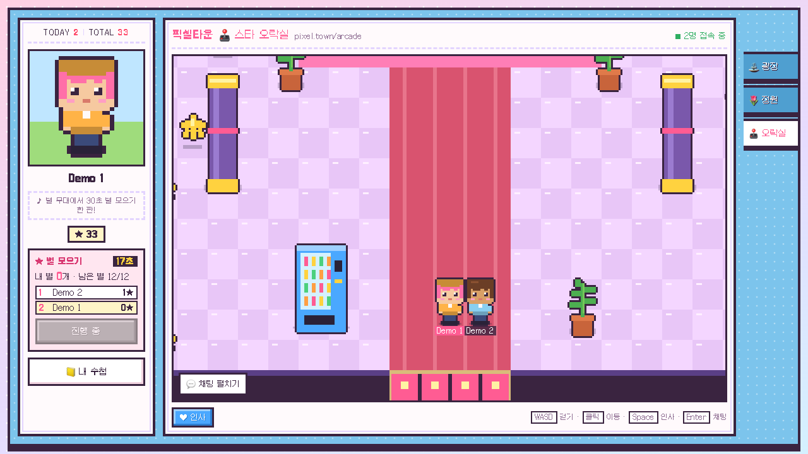

# 검증 증거 (재제작판)

검증일: 2026-10-02 (Asia/Seoul). 브랜치 `cheng80/cyworld-remake`, 게임 `216d963` + 입장 위치 비키기 수정 `12aefce`. 진행 상태 정본은 [PROJECT_STATUS](03_PROJECT_STATUS.md)다. 거절된 1차 판(`dc2e191`)의 화면 증거는 삭제했다.

실행 환경: 이 worktree 전용 개발 서버(Vite 5273, PB 18190, Colyseus 12667)와 통합 테스트 전용 서버(PB 18191, Colyseus 12668). 원래 체크아웃의 5173/18090/12567 프로세스와 데이터는 건드리지 않았다. 외부 접속은 PocketBase 공식 바이너리 다운로드(checksum 검증)와 원본 사이트 읽기 전용 관찰(MQTT 차단)뿐이다.

## 1. 자동 테스트

| 명령 | 결과 | 내용 |
|---|---|---|
| `npm --prefix colyseus test` | 14/14 | 기존 outbox·별 상한·PB 훅 5개 + 신규 맵·깊이·충돌 9개 |
| `PIXELTOWN_TEST_PB_PORT=18191 PIXELTOWN_TEST_GAME_PORT=12668 npm run test:integration` | 13/13 | [tests/report.json](../tests/report.json) |
| `CHROME_PATH=… PIXELTOWN_WEB_PORT=5273 node tests/ui-check.mjs` | 5/5 | [tests/ui-report.json](../tests/ui-report.json), 스크린샷 `docs/assets/` |
| `npm run build` | 통과 | JS 441KB(gzip 140KB), Galmuri11 woff2 2개 671KB |

신규 단위 테스트(`colyseus/test/world.test.js`): 세 장소 모두 입구가 비어 있음, 걷는 8도트 칸 전부가 시작점과 연결(고립 0), 출입구 도달 가능, 세 맵의 타일·소품 구성이 서로 다름, 모든 footprint가 그림 안·그림 넓이 60% 미만·발선에 붙음, 나무 수관 아래 통과·밑동 차단, 건물 벽 바닥 차단·지붕 뒤 잔디 도달, 물·오락실 벽 차단·다리 횡단, 밑동 모서리 비켜가기, 오락기 섬 뒤 통과, 서버 입구 이름 검증(`__proto__` 등 거부).

통합 테스트 주요 수치: 별 초기5 → 생성 간격 1501–1550ms → 10.7초에 12개 → 3.1초간 12 유지 → 회수 후 956ms에 새 ID로 12 복귀. 20명 smoke: 입장 61ms, 입력 600개(클라이언트당 9.9Hz), 클라이언트별 snapshot 최소 58회(50ms 틱), 채팅 전달 p95 43ms. 단일 머신 짧은 기능 점검이며 수용량 측정이 아니다.

## 2. 깊이·충돌 (AC-014) — 실제 브라우저에서 클릭 이동과 방향키로 확인

좌표는 서버가 확정한 발밑 위치다.

| 장면 | 서버 위치 | 결과 |
|---|---|---|
| 광장 나무(밑동 y≈179–183) 북쪽 | (148.1, 171.2) | 수관 아래로 걸어 들어감, 아바타가 수관에 가려지고 이름표만 보임 |
| 같은 나무 남쪽 | (147.2, 194.9) | 아바타가 나무 앞에 그려짐 |
| 남쪽에서 밑동으로 ↑ | (147.2, 187.4)에서 정지 | 밑동만 막힘 |
| 미니홈피 하우스 뒤 잔디 | (120.7, 48.7) | 지붕 그림 영역을 걸어 다님, 지붕에 가려짐 |
| 하우스 문 앞에서 ↑ | (120.5, 99.8)에서 정지 | 벽 바닥(footprint y 66–96)에서 막힘 |
| 오락실 오락기 섬 뒤 / 앞 | (108.6, 190.9) / (108.0, 221.9) | 뒤에서는 가려지고 앞에서는 앞에 보임 |
| 경품 카운터 뒤 | (539.6, 312.0) | 카운터에 하반신이 가려짐 |
| 오락실 북쪽 벽으로 ↑ | (321.1, 51.1)에서 정지 | 벽 타일(y<48) 통과 불가 |
| 정원 퍼걸러 아래 | (99.8, 216.7) | 격자 지붕(fg)이 아바타 위에 그려지고 틈으로 보임 |
| 정원 다리에서 연못으로 ↑ | (272.0, 195.3)에서 정지 | 물 타일 통과 불가 |

| 뒤 | 앞 |
|---|---|
|  |  |
|  |  |
|  |  |
|  |  |
|  |  |

충돌 디버그 화면(`?debug=collision`): 파랑 = 그림 영역, 빨강 = 바닥 footprint·막힌 타일. footprint가 그림보다 훨씬 작다.

## 3. 장소별 맵 (AC-015)

| 광장 | 정원 | 오락실 |
|---|---|---|
|  |  |  |

출입구 왕복: Demo 2가 광장 동쪽 매트를 밟아 정원 서쪽 입구(44, 218)에 도착, 이때 광장의 Demo 1 화면에서 사라짐. 정원 서쪽 매트로 돌아와 광장 동쪽 입구(596, 226)에 도착하고 두 사람이 다시 함께 보임.

## 4. 두 사용자·채팅 (AC-003/004/005/006)

- Demo 2가 클릭 이동으로 (+40, −30) 이동 → Demo 1 화면의 Demo 2 위치가 같은 좌표로 동기화.
- Demo 2 채팅 → Demo 2 머리 위 말풍선, 접혀 있던 Demo 1에 미읽음 배지 1 → 펼치면 배지 사라지고 로그에 표시.
- 채팅 입력란에 `wasd`를 입력하는 동안 아바타 위치 변화 없음.
- 투명도 슬라이더 키보드 조작: 최소 20%, 최대 95%, 배경 `rgba(255,250,252,0.2)`, 로그 opacity 1. 75%로 바꾸고 새로고침하면 75% 유지, 펼침 상태도 유지.
- 새로고침 직후 이전 소켓 정리 전에 다시 들어가면 서버가 409를 줄 수 있다. 클라이언트가 700ms 간격으로 최대 6회 재시도해 해결했다. 같은 입구에 두 사람이 서면 서버가 16도트 옆 빈자리로 세운다.

## 5. 별 모으기 기본 30초 (AC-007/008/013)

두 사용자가 오락실에서 기본 30초 라운드를 진행했다(테스트용 단축 없음). 남은 시간 30초, 초기 별 5개, 수집하지 않은 13.5초 동안 5→12로 늘고 12에서 멈춤. 이후 Demo 1이 클릭 이동으로 별을 모았고 32초 뒤 종료, "기록과 별 보상이 저장되었어요" 안내 후 수첩에 새 결과·보상이 보였다. 같은 기능의 이전 실행에서는 0:0 동점이 1, 1 순위로 표시됐다.

## 6. 화면 크기·도트 스케일 (AC-011/016)

| 뷰포트 | 문서 scroll | 장치 픽셀 배율 | 저해상도 월드 | smoothing | Galmuri | 방향패드 이동 | 채팅 전송 버튼 |
|---|---|---|---|---|---|---|---|
| 1280×720 | 1280×720 | 3 | 292×182 | false | 로드 | - | - |
| 390×844 (DPR3) | 390×844 | 6 | 166×332 | false | 로드 | +33 | 화면 안 |
| 844×390 (DPR3) | 844×390 | 6 | 352×127 | false | 로드 | +36 | 화면 안 |
| 390×430 (DPR3) | 390×430 | 6 | 166×125 | false | 로드 | +36 | 화면 안 |

캔버스 폭 ÷ 배율의 올림이 저해상도 폭과 같아 정수배 확대만 쓴다. 1280×720 미니룸에서 보이는 월드는 292×182도트로 원본(800×500 캔버스 ÷ 3배 ≈ 266×166)과 비슷한 밀도다.

| 데스크톱 | 모바일 | 모바일 채팅 |
|---|---|---|
|  |  |  |

| 가로 | 가로 채팅 | 낮은 높이 | 낮은 높이 채팅 |
|---|---|---|---|
|  |  |  |  |

입장 화면:

## 7. 미실행·한계

- 실제 iPhone/Android 기기, OS 가상 키보드, 저사양 기기 FPS는 확인하지 않았다. 브라우저 모바일 에뮬레이션(DPR3, touch)만 사용했다.
- 클라이언트 예측이 없다. localhost에서는 50ms 틱 보간으로 충분했지만 인터넷 지연 환경의 조작감은 측정하지 않았다.
- 디자인 승인은 사용자 판단 대상이다. 위 스크린샷이 판단 자료다.
- 연습 모드(혼자 둘러보기)는 이동·별 생성·연습 점수만 확인했고 서버 기록은 만들지 않는다.
